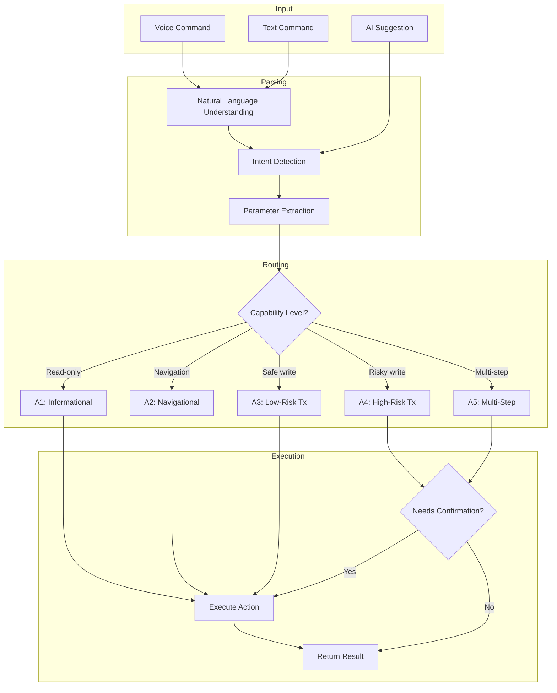
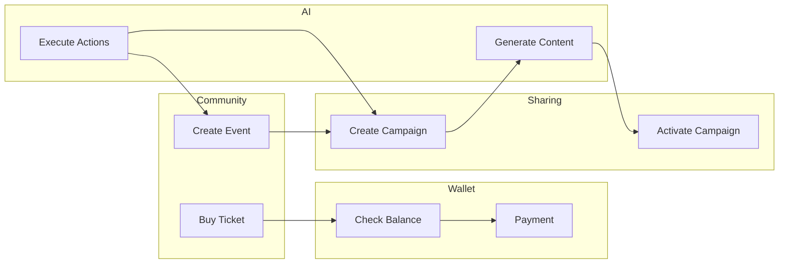
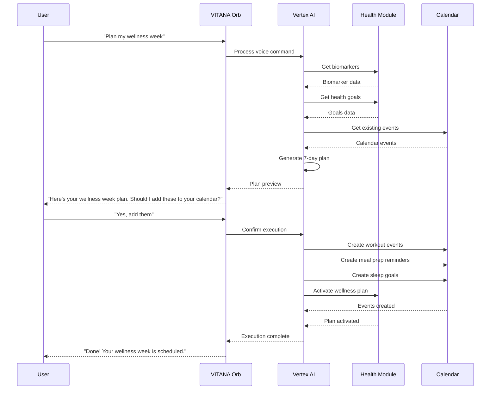
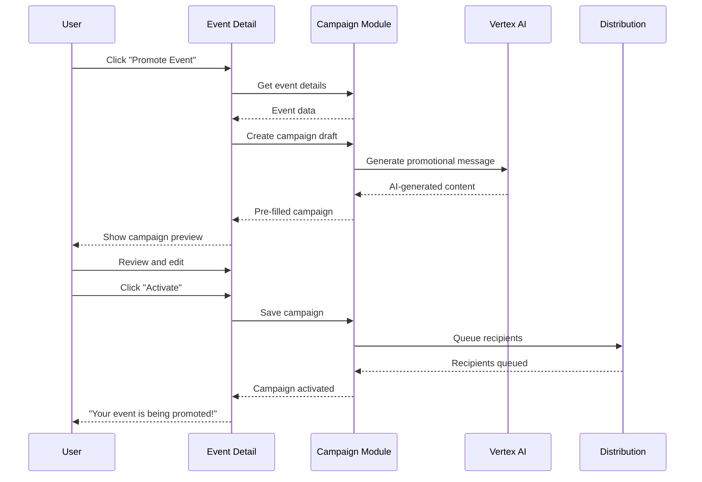

# VITANA Autopilot Action Catalog

> **Complete Reference Guide for All Autopilot Actions**
> 
> Version: 1.0.0 | Last Updated: 2024-12-08
> 
> This document provides the authoritative catalog of all Autopilot actions available in the VITANA system, including detailed execution specifications for AI agents.

---

## Table of Contents

1. [Action Overview Table](#1-action-overview-table)
2. [Detailed Action Definitions](#2-detailed-action-definitions)
3. [Module Summaries](#3-module-summaries)
4. [Dependency Mapping](#4-dependency-mapping)
5. [Risk Classification Summary](#5-risk-classification-summary)
6. [Appendix A: Action → APIs Table](#appendix-a-action--apis-table)
7. [Appendix B: Action → Screens Table](#appendix-b-action--screens-table)
8. [Appendix C: Orchestration Diagrams](#appendix-c-orchestration-diagrams)

---

## 1. Action Overview Table

### Complete Action Catalog (169 Actions)

| Action ID | Name | Level | Module | Description | Required APIs | Required Screens | Tenant | Permissions | Risk |
|-----------|------|-------|--------|-------------|---------------|------------------|--------|-------------|------|
| A1-COMM-001 | List My Events | A1 | Community | Retrieve user's upcoming and past events | `useUserEvents` | COMM-001 | Global | community | Low |
| A1-COMM-002 | Discover Events | A1 | Community | Search and filter community events | `useGlobalEvents` | COMM-002 | Global | community | Low |
| A1-COMM-003 | Get Event Details | A1 | Community | Retrieve full details of a specific event | `useEventDetails` | COMM-003 | Global | community | Low |
| A1-COMM-004 | List My Groups | A1 | Community | Retrieve user's group memberships | `useUserGroups` | COMM-010 | Global | community | Low |
| A1-COMM-005 | Discover Groups | A1 | Community | Search and browse community groups | `useGlobalGroups` | COMM-011 | Global | community | Low |
| A1-COMM-006 | Get Group Details | A1 | Community | Retrieve full details of a specific group | `useGroupDetails` | COMM-012 | Global | community | Low |
| A1-COMM-007 | List Live Rooms | A1 | Community | Get active and scheduled live rooms | `useLiveRooms` | COMM-020 | Global | community | Low |
| A1-COMM-008 | Get Live Room Details | A1 | Community | Retrieve live room configuration | `useLiveRoomDetails` | COMM-021 | Global | community | Low |
| A1-COMM-009 | List Daily Matches | A1 | Community | Get today's AI-generated user matches | `useDailyMatches` | COMM-030 | Global | community | Low |
| A1-COMM-010 | Get Connection Requests | A1 | Community | List pending connection requests | `useConnectionRequests` | COMM-031 | Global | community | Low |
| A2-COMM-011 | Navigate to Events Hub | A2 | Community | Open Events & Meetups screen | router.navigate | COMM-001 | Global | community | Low |
| A2-COMM-012 | Navigate to Event Detail | A2 | Community | Open specific event detail view | router.navigate | COMM-003 | Global | community | Low |
| A2-COMM-013 | Navigate to Groups Hub | A2 | Community | Open Groups discovery screen | router.navigate | COMM-010 | Global | community | Low |
| A2-COMM-014 | Navigate to Live Rooms | A2 | Community | Open Live Rooms listing | router.navigate | COMM-020 | Global | community | Low |
| A2-COMM-015 | Open Create Event Dialog | A2 | Community | Open event creation overlay | dialog.open | OVRL-017 | Global | community | Low |
| A3-COMM-016 | Create Event | A3 | Community | Create a new community event | `useCreateEvent` | COMM-001, OVRL-017 | Global | community | Low |
| A3-COMM-017 | Update Event | A3 | Community | Modify existing event details | `useUpdateEvent` | COMM-003 | Global | community | Low |
| A3-COMM-018 | Cancel Event | A3 | Community | Cancel an event with notifications | `useCancelEvent` | COMM-003 | Global | community | Medium |
| A3-COMM-019 | RSVP to Event | A3 | Community | Register attendance for free event | `useRSVPEvent` | COMM-003 | Global | community | Low |
| A3-COMM-020 | Cancel RSVP | A3 | Community | Remove attendance registration | `useCancelRSVP` | COMM-003 | Global | community | Low |
| A3-COMM-021 | Create Group | A3 | Community | Create a new community group | `useCreateGroup` | COMM-010, OVRL-018 | Global | community | Low |
| A3-COMM-022 | Join Group | A3 | Community | Join an existing group | `useJoinGroup` | COMM-012 | Global | community | Low |
| A3-COMM-023 | Leave Group | A3 | Community | Leave a group membership | `useLeaveGroup` | COMM-012 | Global | community | Low |
| A3-COMM-024 | Create Group Post | A3 | Community | Post content to a group | `useCreateGroupPost` | COMM-012 | Global | community | Low |
| A3-COMM-025 | Start Live Room | A3 | Community | Create and start a live audio room | `useStartLiveRoom` | COMM-020 | Global | community | Low |
| A3-COMM-026 | Join Live Room | A3 | Community | Enter an active live room | `useJoinLiveRoom` | COMM-021 | Global | community | Low |
| A3-COMM-027 | Leave Live Room | A3 | Community | Exit a live room session | `useLeaveLiveRoom` | COMM-021 | Global | community | Low |
| A4-COMM-028 | Purchase Event Ticket | A4 | Community | Buy ticket via Stripe checkout | `create-ticket-checkout` | COMM-003 | Global | community | High |
| A3-COMM-029 | Send Connection Request | A3 | Community | Send friend/connection request | `useSendConnectionRequest` | COMM-031 | Global | community | Low |
| A3-COMM-030 | Accept Connection Request | A3 | Community | Accept incoming connection | `useAcceptConnection` | COMM-031 | Global | community | Low |
| A1-DISC-001 | Search Products | A1 | Discover | Search marketplace products | `useProductSearch` | DISC-001 | Global | community | Low |
| A1-DISC-002 | Browse Categories | A1 | Discover | List product categories | `useCategories` | DISC-002 | Global | community | Low |
| A1-DISC-003 | Get Product Details | A1 | Discover | Retrieve product information | `useProductDetails` | DISC-003 | Global | community | Low |
| A1-DISC-004 | Search Services | A1 | Discover | Search available services | `useServiceSearch` | DISC-010 | Global | community | Low |
| A1-DISC-005 | Get Service Details | A1 | Discover | Retrieve service information | `useServiceDetails` | DISC-011 | Global | community | Low |
| A1-DISC-006 | View Cart | A1 | Discover | Get current cart contents | `useCart` | DISC-020 | Global | community | Low |
| A1-DISC-007 | View Order History | A1 | Discover | Get past orders and tickets | `useOrderHistory` | DISC-030 | Global | community | Low |
| A1-DISC-008 | Get Order Details | A1 | Discover | Retrieve specific order info | `useOrderDetails` | DISC-031 | Global | community | Low |
| A2-DISC-009 | Navigate to Marketplace | A2 | Discover | Open product marketplace | router.navigate | DISC-001 | Global | community | Low |
| A2-DISC-010 | Navigate to Services | A2 | Discover | Open services listing | router.navigate | DISC-010 | Global | community | Low |
| A2-DISC-011 | Navigate to Cart | A2 | Discover | Open shopping cart | router.navigate | DISC-020 | Global | community | Low |
| A2-DISC-012 | Navigate to Orders | A2 | Discover | Open order history | router.navigate | DISC-030 | Global | community | Low |
| A3-DISC-013 | Add to Cart | A3 | Discover | Add product to shopping cart | `useAddToCart` | DISC-003 | Global | community | Low |
| A3-DISC-014 | Update Cart Quantity | A3 | Discover | Change item quantity in cart | `useUpdateCartItem` | DISC-020 | Global | community | Low |
| A3-DISC-015 | Remove from Cart | A3 | Discover | Remove item from cart | `useRemoveFromCart` | DISC-020 | Global | community | Low |
| A3-DISC-016 | Clear Cart | A3 | Discover | Remove all items from cart | `useClearCart` | DISC-020 | Global | community | Low |
| A3-DISC-017 | Add to Wishlist | A3 | Discover | Bookmark product for later | `useAddToWishlist` | DISC-003 | Global | community | Low |
| A3-DISC-018 | Remove from Wishlist | A3 | Discover | Remove bookmarked product | `useRemoveFromWishlist` | DISC-003 | Global | community | Low |
| A3-DISC-019 | Book Service | A3 | Discover | Schedule a service appointment | `useBookService` | DISC-011 | Global | community | Low |
| A3-DISC-020 | Cancel Booking | A3 | Discover | Cancel service appointment | `useCancelBooking` | DISC-031 | Global | community | Medium |
| A4-DISC-021 | Checkout Cart | A4 | Discover | Process cart payment via Stripe | `create-checkout-session` | DISC-021 | Global | community | High |
| A4-DISC-022 | Request Refund | A4 | Discover | Request order refund | `useRequestRefund` | DISC-031 | Global | community | High |
| A5-DISC-023 | Compare Products | A5 | Discover | AI comparison of multiple products | `ai-product-compare` | DISC-003 | Global | community | Low |
| A1-HLTH-001 | Get Health Overview | A1 | Health | Retrieve health dashboard summary | `useHealthDashboard` | HLTH-001 | Global | patient | Low |
| A1-HLTH-002 | Get Biomarker Data | A1 | Health | Retrieve latest biomarker values | `useBiomarkers` | HLTH-002 | Maxina | patient | Low |
| A1-HLTH-003 | Get Biomarker History | A1 | Health | Retrieve biomarker trend data | `useBiomarkerHistory` | HLTH-003 | Maxina | patient | Low |
| A1-HLTH-004 | Get AI Health Insights | A1 | Health | Retrieve AI-generated insights | `useHealthInsights` | HLTH-004 | Maxina | patient | Low |
| A1-HLTH-005 | List Health Plans | A1 | Health | Get active AI-generated plans | `useHealthPlans` | HLTH-010 | Maxina | patient | Low |
| A1-HLTH-006 | Get Plan Details | A1 | Health | Retrieve specific plan content | `usePlanDetails` | HLTH-011 | Maxina | patient | Low |
| A1-HLTH-007 | Get Hydration Stats | A1 | Health | Retrieve hydration tracking data | `useHydrationStats` | HLTH-020 | Global | patient | Low |
| A1-HLTH-008 | Get Sleep Stats | A1 | Health | Retrieve sleep tracking data | `useSleepStats` | HLTH-021 | Global | patient | Low |
| A1-HLTH-009 | Get Activity Stats | A1 | Health | Retrieve activity/steps data | `useActivityStats` | HLTH-022 | Global | patient | Low |
| A1-HLTH-010 | Get Nutrition Log | A1 | Health | Retrieve nutrition tracking data | `useNutritionLog` | HLTH-023 | Maxina | patient | Low |
| A2-HLTH-011 | Navigate to Health Hub | A2 | Health | Open health dashboard | router.navigate | HLTH-001 | Global | patient | Low |
| A2-HLTH-012 | Navigate to Biomarkers | A2 | Health | Open biomarker viewer | router.navigate | HLTH-002 | Maxina | patient | Low |
| A2-HLTH-013 | Navigate to Plans | A2 | Health | Open AI plans section | router.navigate | HLTH-010 | Maxina | patient | Low |
| A2-HLTH-014 | Navigate to Trackers | A2 | Health | Open health trackers | router.navigate | HLTH-020 | Global | patient | Low |
| A3-HLTH-015 | Log Hydration | A3 | Health | Record water intake | `useLogHydration` | HLTH-020 | Global | patient | Low |
| A3-HLTH-016 | Log Sleep | A3 | Health | Record sleep session | `useLogSleep` | HLTH-021 | Global | patient | Low |
| A3-HLTH-017 | Log Activity | A3 | Health | Record exercise/steps | `useLogActivity` | HLTH-022 | Global | patient | Low |
| A3-HLTH-018 | Log Nutrition | A3 | Health | Record food/meal intake | `useLogNutrition` | HLTH-023 | Maxina | patient | Low |
| A3-HLTH-019 | Create Health Goal | A3 | Health | Set a new health goal | `useCreateHealthGoal` | HLTH-030 | Global | patient | Low |
| A3-HLTH-020 | Update Health Goal | A3 | Health | Modify existing goal | `useUpdateHealthGoal` | HLTH-030 | Global | patient | Low |
| A3-HLTH-021 | Generate AI Plan | A3 | Health | Request AI health plan | `generate-health-plan` | HLTH-010 | Maxina | patient | Medium |
| A4-HLTH-022 | Update Biomarkers | A4 | Health | Manually update biomarker values | `useUpdateBiomarkers` | HLTH-002 | Maxina | patient | High |
| A4-HLTH-023 | Connect Wearable | A4 | Health | Link external wearable device | `connect-wearable` | HLTH-040 | Maxina | patient | Medium |
| A4-HLTH-024 | Sync Wearable Data | A4 | Health | Pull latest wearable data | `sync-wearable-data` | HLTH-040 | Maxina | patient | Medium |
| A3-HLTH-025 | Activate Plan | A3 | Health | Start following AI plan | `useActivatePlan` | HLTH-011 | Maxina | patient | Low |
| A3-HLTH-026 | Complete Plan Task | A3 | Health | Mark plan task complete | `useCompletePlanTask` | HLTH-011 | Maxina | patient | Low |
| A3-HLTH-027 | Request Health Education | A3 | Health | Get educational content | `useHealthEducation` | HLTH-050 | Global | patient | Low |
| A5-HLTH-028 | Plan Wellness Week | A5 | Health | AI plans full week of wellness | `plan-wellness-week` | HLTH-010 | Maxina | patient | Medium |
| A5-HLTH-029 | Analyze Health Trends | A5 | Health | AI analysis of health patterns | `analyze-health-trends` | HLTH-004 | Maxina | patient | Low |
| A5-HLTH-030 | Generate Supplement Plan | A5 | Health | AI supplement recommendations | `generate-supplement-plan` | HLTH-010, DISC-001 | Maxina | patient | Medium |
| A1-SHAR-001 | List Campaigns | A1 | Sharing | Get user's campaigns | `useCampaigns` | SHAR-001 | Global | community | Low |
| A1-SHAR-002 | Get Campaign Details | A1 | Sharing | Retrieve campaign configuration | `useCampaignDetails` | SHAR-002 | Global | community | Low |
| A1-SHAR-003 | Get Campaign Analytics | A1 | Sharing | Retrieve performance metrics | `useCampaignAnalytics` | SHAR-003 | Global | community | Low |
| A1-SHAR-004 | List Distribution Channels | A1 | Sharing | Get connected channels | `useDistributionChannels` | SHAR-010 | Global | community | Low |
| A1-SHAR-005 | Get Channel Status | A1 | Sharing | Check channel connectivity | `useChannelStatus` | SHAR-010 | Global | community | Low |
| A1-SHAR-006 | List Audience Segments | A1 | Sharing | Get saved audience segments | `useAudienceSegments` | SHAR-020 | Global | community | Low |
| A2-SHAR-007 | Navigate to Campaigns | A2 | Sharing | Open campaigns hub | router.navigate | SHAR-001 | Global | community | Low |
| A2-SHAR-008 | Navigate to Campaign Detail | A2 | Sharing | Open specific campaign | router.navigate | SHAR-002 | Global | community | Low |
| A2-SHAR-009 | Open Create Campaign Dialog | A2 | Sharing | Open campaign wizard | dialog.open | OVRL-020 | Global | community | Low |
| A3-SHAR-010 | Create Campaign | A3 | Sharing | Create new campaign draft | `useCreateCampaign` | SHAR-001, OVRL-020 | Global | community | Low |
| A3-SHAR-011 | Update Campaign | A3 | Sharing | Modify campaign details | `useUpdateCampaign` | SHAR-002 | Global | community | Low |
| A3-SHAR-012 | Delete Campaign | A3 | Sharing | Remove campaign | `useDeleteCampaign` | SHAR-002 | Global | community | Medium |
| A3-SHAR-013 | Duplicate Campaign | A3 | Sharing | Clone existing campaign | `useDuplicateCampaign` | SHAR-002 | Global | community | Low |
| A3-SHAR-014 | Connect Channel | A3 | Sharing | Link distribution channel | `useConnectChannel` | SHAR-010 | Global | community | Low |
| A3-SHAR-015 | Disconnect Channel | A3 | Sharing | Unlink distribution channel | `useDisconnectChannel` | SHAR-010 | Global | community | Low |
| A3-SHAR-016 | Create Audience Segment | A3 | Sharing | Define new audience | `useCreateSegment` | SHAR-020 | Global | community | Low |
| A3-SHAR-017 | Generate Message Draft | A3 | Sharing | AI-generate message content | `generate-campaign-message` | SHAR-002 | Global | community | Low |
| A3-SHAR-018 | Schedule Campaign | A3 | Sharing | Set campaign activation time | `useScheduleCampaign` | SHAR-002 | Global | community | Low |
| A4-SHAR-019 | Activate Campaign | A4 | Sharing | Start campaign distribution | `activate-campaign` | SHAR-002 | Global | community | Medium |
| A4-SHAR-020 | Send Test Message | A4 | Sharing | Send preview to self | `send-test-message` | SHAR-002 | Global | community | Low |
| A5-SHAR-021 | Full Campaign Workflow | A5 | Sharing | Create, configure, and schedule | Multi-API | SHAR-001, SHAR-002 | Global | community | Medium |
| A5-SHAR-022 | Promote Event Campaign | A5 | Sharing | Auto-create campaign from event | Multi-API | COMM-003, SHAR-001 | Global | community | Medium |
| A1-WALL-001 | Get Wallet Balance | A1 | Wallet | Retrieve all currency balances | `useWalletBalance` | WALL-001 | Global | community | Low |
| A1-WALL-002 | Get Transaction History | A1 | Wallet | List past transactions | `useTransactionHistory` | WALL-002 | Global | community | Low |
| A1-WALL-003 | Get Transaction Details | A1 | Wallet | Retrieve specific transaction | `useTransactionDetails` | WALL-003 | Global | community | Low |
| A1-WALL-004 | Get Reward Balance | A1 | Wallet | Retrieve reward points | `useRewardBalance` | WALL-010 | Global | community | Low |
| A1-WALL-005 | Get Reward History | A1 | Wallet | List reward transactions | `useRewardHistory` | WALL-011 | Global | community | Low |
| A1-WALL-006 | Get Exchange Rates | A1 | Wallet | Current conversion rates | `useExchangeRates` | WALL-020 | Global | community | Low |
| A1-WALL-007 | List Subscriptions | A1 | Wallet | Get active subscriptions | `useSubscriptions` | WALL-030 | Global | community | Low |
| A1-WALL-008 | Get Subscription Details | A1 | Wallet | Retrieve subscription info | `useSubscriptionDetails` | WALL-031 | Global | community | Low |
| A2-WALL-009 | Navigate to Wallet | A2 | Wallet | Open wallet dashboard | router.navigate | WALL-001 | Global | community | Low |
| A2-WALL-010 | Navigate to Rewards | A2 | Wallet | Open rewards section | router.navigate | WALL-010 | Global | community | Low |
| A4-WALL-011 | Transfer Credits | A4 | Wallet | Send credits to user | `transfer-credits` | WALL-001 | Global | community | High |
| A4-WALL-012 | Exchange Currency | A4 | Wallet | Convert between currencies | `exchange-currency` | WALL-020 | Global | community | High |
| A4-WALL-013 | Add Payment Method | A4 | Wallet | Link new payment source | `add-payment-method` | WALL-040 | Global | community | High |
| A4-WALL-014 | Remove Payment Method | A4 | Wallet | Unlink payment source | `remove-payment-method` | WALL-040 | Global | community | High |
| A4-WALL-015 | Top Up Balance | A4 | Wallet | Add funds via Stripe | `topup-balance` | WALL-001 | Global | community | High |
| A4-WALL-016 | Subscribe to Plan | A4 | Wallet | Start subscription | `create-subscription` | WALL-030 | Global | community | High |
| A4-WALL-017 | Cancel Subscription | A4 | Wallet | End subscription | `cancel-subscription` | WALL-031 | Global | community | High |
| A4-WALL-018 | Update Subscription | A4 | Wallet | Change subscription tier | `update-subscription` | WALL-031 | Global | community | High |
| A3-WALL-019 | Redeem Reward | A3 | Wallet | Use reward points | `useRedeemReward` | WALL-010 | Global | community | Low |
| A5-WALL-020 | Auto-Renew Setup | A5 | Wallet | Configure auto-renewal | Multi-API | WALL-030 | Global | community | Medium |
| A1-AI-001 | Get AI Conversation History | A1 | AI | Retrieve past conversations | `useAIConversations` | AI-001 | Global | community | Low |
| A1-AI-002 | Get Conversation Messages | A1 | AI | Retrieve specific chat history | `useConversationMessages` | AI-002 | Global | community | Low |
| A1-AI-003 | Get AI Insights | A1 | AI | Retrieve generated insights | `useAIInsights` | AI-003 | Global | community | Low |
| A1-AI-004 | Get Autopilot Actions | A1 | AI | List pending autopilot actions | `useAutopilotActions` | AI-010 | Global | community | Low |
| A1-AI-005 | Get Autopilot Preferences | A1 | AI | Retrieve autopilot settings | `useAutopilotPreferences` | AI-011 | Global | community | Low |
| A2-AI-006 | Navigate to AI Assistant | A2 | AI | Open AI chat interface | router.navigate | AI-001 | Global | community | Low |
| A2-AI-007 | Open VITANA Orb | A2 | AI | Expand voice interface | orb.expand | OVRL-001 | Global | community | Low |
| A3-AI-008 | Start AI Conversation | A3 | AI | Begin new AI chat session | `useStartConversation` | AI-001 | Global | community | Low |
| A3-AI-009 | Send AI Message | A3 | AI | Send message to AI | `useSendAIMessage` | AI-001 | Global | community | Low |
| A3-AI-010 | Update Autopilot Preferences | A3 | AI | Modify autopilot settings | `useUpdateAutopilotPrefs` | AI-011 | Global | community | Low |
| A4-AI-011 | Start Vertex Live Session | A4 | AI | Begin real-time voice AI | `vitanaland-live` | OVRL-001 | Global | community | Medium |
| A3-AI-012 | Execute Autopilot Action | A3 | AI | Run selected autopilot action | `execute-autopilot-action` | AI-010 | Global | community | Low |
| A3-AI-013 | Dismiss Autopilot Action | A3 | AI | Skip/ignore autopilot action | `useDismissAction` | AI-010 | Global | community | Low |
| A3-AI-014 | Generate AI Summary | A3 | AI | Create content summary | `generate-summary` | AI-001 | Global | community | Low |
| A5-AI-015 | Multi-Action Autopilot | A5 | AI | Execute batch of actions | Multi-API | AI-010 | Global | community | Medium |
| A5-AI-016 | Contextual AI Planning | A5 | AI | AI plans based on context | Multi-API | AI-001 | Global | community | Medium |
| A5-AI-017 | Voice Command Workflow | A5 | AI | Multi-step voice execution | `vitanaland-live` + Multi | OVRL-001 | Global | community | Medium |
| A1-MEM-001 | List Diary Entries | A1 | Memory | Get journal entries | `useDiaryEntries` | MEM-001 | Global | community | Low |
| A1-MEM-002 | Get Diary Entry | A1 | Memory | Retrieve specific entry | `useDiaryEntry` | MEM-002 | Global | community | Low |
| A1-MEM-003 | Get AI Memory | A1 | Memory | Retrieve AI memories | `useAIMemory` | MEM-010 | Global | community | Low |
| A1-MEM-004 | Get Life Events | A1 | Memory | Retrieve timeline events | `useLifeEvents` | MEM-020 | Global | community | Low |
| A2-MEM-005 | Navigate to Diary | A2 | Memory | Open diary screen | router.navigate | MEM-001 | Global | community | Low |
| A2-MEM-006 | Navigate to Timeline | A2 | Memory | Open life timeline | router.navigate | MEM-020 | Global | community | Low |
| A3-MEM-007 | Create Diary Entry | A3 | Memory | Add new journal entry | `useCreateDiaryEntry` | MEM-001 | Global | community | Low |
| A3-MEM-008 | Update Diary Entry | A3 | Memory | Modify existing entry | `useUpdateDiaryEntry` | MEM-002 | Global | community | Low |
| A3-MEM-009 | Delete Diary Entry | A3 | Memory | Remove journal entry | `useDeleteDiaryEntry` | MEM-002 | Global | community | Low |
| A3-MEM-010 | Add Life Event | A3 | Memory | Create timeline marker | `useAddLifeEvent` | MEM-020 | Global | community | Low |
| A3-MEM-011 | Voice Diary Entry | A3 | Memory | Record voice journal | `voice-diary-entry` | MEM-001 | Global | community | Low |
| A5-MEM-012 | AI Memory Consolidation | A5 | Memory | Process and store memories | `consolidate-memories` | MEM-010 | Global | community | Low |
| A5-MEM-013 | Generate Life Summary | A5 | Memory | AI summary of timeline | `generate-life-summary` | MEM-020 | Global | community | Low |
| A1-ADMN-001 | Get Tenant Info | A1 | Admin | Retrieve tenant configuration | `useTenantInfo` | ADMN-001 | Staff+ | staff | Low |
| A1-ADMN-002 | List Tenant Users | A1 | Admin | Get tenant user list | `useTenantUsers` | ADMN-002 | Staff+ | admin | Low |
| A1-ADMN-003 | Get User Details | A1 | Admin | Retrieve user information | `useUserDetails` | ADMN-003 | Staff+ | admin | Low |
| A1-ADMN-004 | Get Audit Logs | A1 | Admin | Retrieve audit events | `useAuditLogs` | ADMN-010 | Staff+ | admin | Low |
| A1-ADMN-005 | Get System Health | A1 | Admin | Check API/DB status | `useSystemHealth` | ADMN-020 | Staff+ | admin | Low |
| A1-ADMN-006 | Get Automation Rules | A1 | Admin | List active rules | `useAutomationRules` | ADMN-030 | Staff+ | admin | Low |
| A2-ADMN-007 | Navigate to Admin Panel | A2 | Admin | Open admin dashboard | router.navigate | ADMN-001 | Staff+ | staff | Low |
| A2-ADMN-008 | Navigate to User Management | A2 | Admin | Open user admin | router.navigate | ADMN-002 | Staff+ | admin | Low |
| A2-ADMN-009 | Navigate to Audit Logs | A2 | Admin | Open audit viewer | router.navigate | ADMN-010 | Staff+ | admin | Low |
| A3-ADMN-010 | Create Automation Rule | A3 | Admin | Add new automation | `useCreateAutomationRule` | ADMN-030 | Staff+ | admin | Medium |
| A3-ADMN-011 | Update Automation Rule | A3 | Admin | Modify automation | `useUpdateAutomationRule` | ADMN-030 | Staff+ | admin | Medium |
| A3-ADMN-012 | Toggle Automation Rule | A3 | Admin | Enable/disable rule | `useToggleAutomationRule` | ADMN-030 | Staff+ | admin | Medium |
| A3-ADMN-013 | Send System Notification | A3 | Admin | Broadcast to users | `useSendSystemNotification` | ADMN-040 | Staff+ | admin | Medium |
| A4-ADMN-014 | Update User Role | A4 | Admin | Change user permissions | `useUpdateUserRole` | ADMN-003 | Staff+ | admin | High |
| A4-ADMN-015 | Suspend User | A4 | Admin | Disable user account | `useSuspendUser` | ADMN-003 | Staff+ | admin | High |
| A4-ADMN-016 | Delete User | A4 | Admin | Remove user account | `useDeleteUser` | ADMN-003 | Staff+ | admin | High |
| A4-ADMN-017 | Update Tenant Settings | A4 | Admin | Modify tenant config | `useUpdateTenantSettings` | ADMN-001 | Staff+ | admin | High |
| A3-ADMN-018 | Review AI Recommendation | A3 | Admin | Approve/reject AI suggestion | `useReviewRecommendation` | ADMN-050 | Staff+ | admin | Medium |
| A5-ADMN-019 | Deploy Automation Rule | A5 | Admin | Full rule deployment | Multi-API | ADMN-030 | Staff+ | admin | High |
| A5-ADMN-020 | Bulk User Update | A5 | Admin | Mass user modifications | Multi-API | ADMN-002 | Staff+ | admin | High |
| A1-SETT-001 | Get Profile | A1 | Settings | Retrieve user profile | `useProfile` | SETT-001 | Global | community | Low |
| A1-SETT-002 | Get Preferences | A1 | Settings | Retrieve user settings | `usePreferences` | SETT-002 | Global | community | Low |
| A1-SETT-003 | Get Notification Settings | A1 | Settings | Retrieve notification prefs | `useNotificationSettings` | SETT-003 | Global | community | Low |
| A1-SETT-004 | Get Connected Apps | A1 | Settings | List linked integrations | `useConnectedApps` | SETT-010 | Global | community | Low |
| A2-SETT-005 | Navigate to Settings | A2 | Settings | Open settings screen | router.navigate | SETT-001 | Global | community | Low |
| A2-SETT-006 | Navigate to Profile | A2 | Settings | Open profile editor | router.navigate | SETT-001 | Global | community | Low |
| A3-SETT-007 | Update Profile | A3 | Settings | Modify profile info | `useUpdateProfile` | SETT-001 | Global | community | Low |
| A3-SETT-008 | Update Preferences | A3 | Settings | Change user preferences | `useUpdatePreferences` | SETT-002 | Global | community | Low |
| A3-SETT-009 | Update Notifications | A3 | Settings | Change notification prefs | `useUpdateNotifications` | SETT-003 | Global | community | Low |
| A3-SETT-010 | Upload Avatar | A3 | Settings | Change profile picture | `useUploadAvatar` | SETT-001 | Global | community | Low |
| A3-SETT-011 | Connect App | A3 | Settings | Link external integration | `useConnectApp` | SETT-010 | Global | community | Low |
| A3-SETT-012 | Disconnect App | A3 | Settings | Unlink integration | `useDisconnectApp` | SETT-010 | Global | community | Low |
| A4-SETT-013 | Delete Account | A4 | Settings | Permanently delete account | `useDeleteAccount` | SETT-020 | Global | community | High |
| A4-SETT-014 | Export Data | A4 | Settings | Download personal data | `export-user-data` | SETT-020 | Global | community | Medium |
| A4-SETT-015 | Change Password | A4 | Settings | Update authentication | `useChangePassword` | SETT-020 | Global | community | Medium |

---

## 2. Detailed Action Definitions

### Community Module Actions

---

#### A1-COMM-001: List My Events
- **Name**: List My Events
- **Level**: A1 (Informational)
- **Module**: Community
- **Description**: Retrieve user's upcoming and past events including RSVPs and created events.
- **Primary APIs Used**:
  - Hook: `useUserEvents`
  - Table: `calendar_events`, `event_attendees`
- **Screens Touched**: COMM-001 (Events Hub)
- **Preconditions**:
  - Role: `community` or higher
  - Auth: User must be authenticated
- **Inputs**: Optional filters (date range, status)
- **Outputs**: Array of event objects with RSVP status
- **Failure Modes**: Network error, auth failure
- **Tenant-Specific Behavior**: Available on all tenants
- **Risk Level & Safety Rules**: Low risk; read-only operation
- **Notes for AI Agents**:
  - Use for context when user asks "what events do I have?"
  - Can filter by upcoming vs past
  - Combine with A1-COMM-002 for comprehensive event context

---

#### A1-COMM-002: Discover Events
- **Name**: Discover Events
- **Level**: A1 (Informational)
- **Module**: Community
- **Description**: Search and filter community events by location, date, category.
- **Primary APIs Used**:
  - Hook: `useGlobalEvents`
  - Table: `global_community_events`
- **Screens Touched**: COMM-002 (Event Discovery)
- **Preconditions**:
  - Role: `community` or higher
- **Inputs**: Search query, filters (location, date, category, event_type)
- **Outputs**: Paginated array of public events
- **Failure Modes**: Network error, invalid filter params
- **Tenant-Specific Behavior**: Available on all tenants
- **Risk Level & Safety Rules**: Low risk; read-only operation
- **Notes for AI Agents**:
  - Use when user asks to "find events" or "show me events near me"
  - Apply location filter when user mentions specific area
  - Sort by relevance or date based on user intent

---

#### A1-COMM-003: Get Event Details
- **Name**: Get Event Details
- **Level**: A1 (Informational)
- **Module**: Community
- **Description**: Retrieve complete details of a specific event including tickets, attendees.
- **Primary APIs Used**:
  - Hook: `useEventDetails`
  - RPC: `get_public_event_details`
  - Table: `global_community_events`, `event_ticket_types`, `event_attendees`
- **Screens Touched**: COMM-003 (Event Detail)
- **Preconditions**:
  - Role: `community` or higher
  - Data: Valid event_id
- **Inputs**: event_id (UUID)
- **Outputs**: Full event object with ticket types, attendee count, organizer info
- **Failure Modes**: Event not found, network error
- **Tenant-Specific Behavior**: Available on all tenants
- **Risk Level & Safety Rules**: Low risk; read-only operation
- **Notes for AI Agents**:
  - Use to provide detailed event information
  - Check ticket availability before suggesting purchase
  - Verify user hasn't already RSVP'd before suggesting join

---

#### A3-COMM-016: Create Event
- **Name**: Create Community Event
- **Level**: A3 (Transactional, Low-Risk)
- **Module**: Community
- **Description**: Create a new community event with title, description, time, location, and optional tickets.
- **Primary APIs Used**:
  - Hook: `useCreateEvent`
  - Table: `global_community_events`, `event_ticket_types`
- **Screens Touched**: COMM-001 (Events Hub), OVRL-017 (Create Event Dialog)
- **Preconditions**:
  - Role: `community` or higher
  - Rate limit: max 10 events/day
- **Inputs**:
  - title (string, required)
  - description (string, optional)
  - start_time (datetime, required)
  - end_time (datetime, optional)
  - location (string, optional)
  - virtual_link (string, optional)
  - image_url (string, optional)
  - event_type (enum: meetup|workshop|class|social)
  - ticket_types (array, optional)
- **Outputs**: New event ID, success status
- **Failure Modes**: Validation errors, rate limiting, image upload failure
- **Tenant-Specific Behavior**: Available on all tenants
- **Risk Level & Safety Rules**: Low risk; rate limit enforced
- **Notes for AI Agents**:
  - Validate all required fields before API call
  - Check user's daily event creation count
  - Display toast notification on success/failure
  - Offer to create campaign for promotion (A5-SHAR-022)
  - For paid events, ensure ticket types are configured

---

#### A3-COMM-019: RSVP to Event
- **Name**: RSVP to Event
- **Level**: A3 (Transactional, Low-Risk)
- **Module**: Community
- **Description**: Register attendance for a free community event.
- **Primary APIs Used**:
  - Hook: `useRSVPEvent`
  - Table: `event_attendees`
- **Screens Touched**: COMM-003 (Event Detail)
- **Preconditions**:
  - Role: `community` or higher
  - Data: Event must be free (no ticket_types with price > 0)
  - Data: Event not at capacity
  - Data: User not already RSVP'd
- **Inputs**: event_id (UUID)
- **Outputs**: Attendee record ID, success status
- **Failure Modes**: Already RSVP'd, event full, event cancelled
- **Tenant-Specific Behavior**: Available on all tenants
- **Risk Level & Safety Rules**: Low risk
- **Notes for AI Agents**:
  - Check if event is free vs paid before calling
  - For paid events, use A4-COMM-028 instead
  - Verify event hasn't passed
  - Add to user's calendar after successful RSVP

---

#### A4-COMM-028: Purchase Event Ticket
- **Name**: Purchase Event Ticket
- **Level**: A4 (Transactional, High-Risk)
- **Module**: Community
- **Description**: Purchase ticket(s) for a paid event via Stripe checkout.
- **Primary APIs Used**:
  - Edge Function: `create-ticket-checkout`
  - Hook: `useTicketPurchase`
  - Table: `event_ticket_purchases`, `event_ticket_types`
  - External: Stripe Checkout
- **Screens Touched**: COMM-003 (Event Detail), External (Stripe Checkout)
- **Preconditions**:
  - Role: `community` or higher
  - Data: Valid ticket_type_id with available inventory
  - Data: User email verified
- **Inputs**:
  - event_id (UUID)
  - ticket_type_id (UUID)
  - quantity (number, 1-10)
  - buyer_name (string)
  - buyer_email (string)
- **Outputs**: Stripe checkout URL, session_id
- **Failure Modes**: Tickets sold out, Stripe error, payment declined
- **Tenant-Specific Behavior**: Available on all tenants
- **Risk Level & Safety Rules**: 
  - HIGH RISK: Involves payment
  - MUST require explicit user confirmation
  - Display total price before checkout
  - Log transaction for audit
- **Notes for AI Agents**:
  - ALWAYS confirm with user before initiating purchase
  - Display ticket price and total clearly
  - Open Stripe checkout in popup (not new tab)
  - Handle popup blockers gracefully
  - Do not store payment information

---

#### A3-COMM-025: Start Live Room
- **Name**: Start Live Room
- **Level**: A3 (Transactional, Low-Risk)
- **Module**: Community
- **Description**: Create and start a new live audio room for real-time discussion.
- **Primary APIs Used**:
  - Hook: `useStartLiveRoom`
  - Table: `community_live_streams`
- **Screens Touched**: COMM-020 (Live Rooms), COMM-021 (Live Room View)
- **Preconditions**:
  - Role: `community` or higher
  - Rate limit: max 3 active rooms per user
- **Inputs**:
  - title (string, required)
  - description (string, optional)
  - stream_type (enum: audio|video|hybrid)
  - enable_chat (boolean)
  - enable_recording (boolean)
  - access_level (enum: public|followers|private)
- **Outputs**: Room ID, join URL
- **Failure Modes**: Rate limiting, mic permission denied
- **Tenant-Specific Behavior**: Available on all tenants
- **Risk Level & Safety Rules**: Low risk; rate limit enforced
- **Notes for AI Agents**:
  - Request microphone permission before starting
  - Warn user about recording if enabled
  - Provide join link for sharing
  - Auto-navigate to room after creation

---

### Discover Module Actions

---

#### A1-DISC-001: Search Products
- **Name**: Search Products
- **Level**: A1 (Informational)
- **Module**: Discover
- **Description**: Search marketplace products by name, category, or attributes.
- **Primary APIs Used**:
  - Hook: `useProductSearch`
  - Table: `cj_products`
- **Screens Touched**: DISC-001 (Marketplace)
- **Preconditions**:
  - Role: `community` or higher
- **Inputs**: Query string, filters (category, price range, rating)
- **Outputs**: Paginated product list
- **Failure Modes**: Network error, no results
- **Tenant-Specific Behavior**: Available on all tenants
- **Risk Level & Safety Rules**: Low risk; read-only
- **Notes for AI Agents**:
  - Parse natural language queries for filters
  - "Show me supplements under $50" → category: supplements, maxPrice: 50
  - Include product images in response when available

---

#### A3-DISC-013: Add to Cart
- **Name**: Add to Cart
- **Level**: A3 (Transactional, Low-Risk)
- **Module**: Discover
- **Description**: Add a product to the user's shopping cart.
- **Primary APIs Used**:
  - Hook: `useAddToCart`
  - Table: `cart_items`
- **Screens Touched**: DISC-003 (Product Detail), DISC-020 (Cart)
- **Preconditions**:
  - Role: `community` or higher
  - Data: Product in stock
- **Inputs**:
  - item_id (UUID)
  - quantity (number, default 1)
  - variant (optional)
- **Outputs**: Updated cart, item count
- **Failure Modes**: Out of stock, invalid product
- **Tenant-Specific Behavior**: Available on all tenants
- **Risk Level & Safety Rules**: Low risk
- **Notes for AI Agents**:
  - Check stock availability before adding
  - If item already in cart, increment quantity
  - Show toast confirmation with cart count
  - Offer to continue shopping or view cart

---

#### A4-DISC-021: Checkout Cart
- **Name**: Checkout Cart
- **Level**: A4 (Transactional, High-Risk)
- **Module**: Discover
- **Description**: Process cart payment via Stripe checkout session.
- **Primary APIs Used**:
  - Edge Function: `create-checkout-session`
  - Hook: `useCheckout`
  - Table: `checkout_sessions`, `cart_items`
  - External: Stripe Checkout
- **Screens Touched**: DISC-020 (Cart), DISC-021 (Checkout), External (Stripe)
- **Preconditions**:
  - Role: `community` or higher
  - Data: Cart not empty
  - Data: All items in stock
- **Inputs**:
  - shipping_address (object)
  - billing_address (object, optional)
- **Outputs**: Stripe checkout URL, session_id
- **Failure Modes**: Cart empty, items unavailable, Stripe error, payment declined
- **Tenant-Specific Behavior**: Available on all tenants
- **Risk Level & Safety Rules**:
  - HIGH RISK: Involves payment
  - MUST require explicit user confirmation
  - Display cart total before checkout
  - Validate shipping address
  - Log transaction for audit
- **Notes for AI Agents**:
  - ALWAYS show cart summary before checkout
  - Confirm shipping address with user
  - Open Stripe checkout in popup
  - Clear cart only after successful payment
  - Handle out-of-stock gracefully during checkout

---

#### A5-DISC-023: Compare Products
- **Name**: AI Product Comparison
- **Level**: A5 (Autonomous Multi-Step)
- **Module**: Discover
- **Description**: AI-powered comparison of multiple products with recommendations.
- **Primary APIs Used**:
  - Edge Function: `ai-product-compare`
  - Hook: `useProductDetails` (multiple calls)
  - External: Vertex AI
- **Screens Touched**: DISC-003 (Product Detail)
- **Preconditions**:
  - Role: `community` or higher
  - Data: 2-5 valid product IDs
- **Inputs**: Array of product_ids (2-5 items)
- **Outputs**: Comparison table, AI recommendation, pros/cons
- **Failure Modes**: Products not found, AI service unavailable
- **Tenant-Specific Behavior**: Available on all tenants
- **Risk Level & Safety Rules**: Low risk; read-only with AI processing
- **Notes for AI Agents**:
  - Gather product details for all items first
  - Generate comparison across: price, rating, features
  - Provide clear recommendation with reasoning
  - Consider user's previous purchases if available

---

### Health Module Actions

---

#### A1-HLTH-002: Get Biomarker Data
- **Name**: Get Biomarker Data
- **Level**: A1 (Informational)
- **Module**: Health
- **Description**: Retrieve user's latest biomarker values and reference ranges.
- **Primary APIs Used**:
  - Hook: `useBiomarkers`
  - Table: `biomarkers`, `biomarker_values`
- **Screens Touched**: HLTH-002 (Biomarker Viewer)
- **Preconditions**:
  - Role: `patient` or higher
  - Tenant: Maxina only
- **Inputs**: Optional category filter
- **Outputs**: Array of biomarker objects with values, ranges, trends
- **Failure Modes**: No data available, network error
- **Tenant-Specific Behavior**: Maxina only (clinical data)
- **Risk Level & Safety Rules**: Low risk; read-only PHI access
- **Notes for AI Agents**:
  - Handle missing biomarker data gracefully
  - Do NOT send raw biomarker values to external LLMs
  - Provide context about what biomarkers mean
  - Suggest relevant health plans based on values

---

#### A3-HLTH-021: Generate AI Plan
- **Name**: Generate AI Health Plan
- **Level**: A3 (Transactional, Low-Risk)
- **Module**: Health
- **Description**: Request AI to generate personalized health plan based on biomarkers and goals.
- **Primary APIs Used**:
  - Edge Function: `generate-health-plan`
  - Hook: `useHealthPlans`
  - Table: `ai_health_plans`
  - External: Vertex AI
- **Screens Touched**: HLTH-010 (AI Plans Hub)
- **Preconditions**:
  - Role: `patient` or higher
  - Tenant: Maxina only
  - Data: Some health data available (biomarkers or trackers)
- **Inputs**:
  - plan_type (enum: nutrition|exercise|sleep|hydration|supplement|holistic)
  - goals (array of strings)
  - duration (days)
- **Outputs**: Generated plan object with daily tasks
- **Failure Modes**: Insufficient data, AI service unavailable
- **Tenant-Specific Behavior**: Maxina only
- **Risk Level & Safety Rules**: 
  - Medium risk: AI-generated health advice
  - Disclaimer required: "AI-generated, consult healthcare provider"
  - Do NOT make medical claims
- **Notes for AI Agents**:
  - Gather user's health context before generating
  - Include disclaimer in response
  - Offer to activate plan after generation
  - Suggest relevant products if supplement plan

---

#### A4-HLTH-022: Update Biomarkers
- **Name**: Update Biomarkers
- **Level**: A4 (Transactional, High-Risk)
- **Module**: Health
- **Description**: Manually update biomarker values from lab results or self-reported data.
- **Primary APIs Used**:
  - Hook: `useUpdateBiomarkers`
  - Table: `biomarker_values`
- **Screens Touched**: HLTH-002 (Biomarker Viewer)
- **Preconditions**:
  - Role: `patient` or higher
  - Tenant: Maxina only
- **Inputs**:
  - biomarker_id (UUID)
  - value (number)
  - unit (string)
  - source (enum: lab|self_reported|wearable)
  - measured_at (datetime)
- **Outputs**: Updated biomarker record
- **Failure Modes**: Invalid value, out of range warning
- **Tenant-Specific Behavior**: Maxina only (PHI)
- **Risk Level & Safety Rules**:
  - HIGH RISK: PHI data modification
  - Audit all changes
  - Validate value ranges
  - Require confirmation for extreme values
- **Notes for AI Agents**:
  - ALWAYS confirm values with user before updating
  - Warn if value is outside normal range
  - Log source of data (lab vs self-reported)
  - Trigger insights recalculation after update

---

#### A5-HLTH-028: Plan Wellness Week
- **Name**: Plan Wellness Week
- **Level**: A5 (Autonomous Multi-Step)
- **Module**: Health
- **Description**: AI creates comprehensive week-long wellness plan with daily activities, meals, and goals.
- **Primary APIs Used**:
  - Edge Function: `plan-wellness-week`
  - Hook: `useBiomarkers`, `useHealthGoals`, `useCalendarEvents`
  - Table: `ai_health_plans`, `calendar_events`
  - External: Vertex AI
- **Screens Touched**: HLTH-010 (AI Plans), COMM-001 (Calendar)
- **Preconditions**:
  - Role: `patient` or higher
  - Tenant: Maxina only
  - Data: Health profile completed
- **Inputs**:
  - start_date (date)
  - focus_areas (array: nutrition, exercise, sleep, mindfulness)
  - intensity (enum: light|moderate|intense)
- **Outputs**: 7-day plan with calendar events
- **Failure Modes**: Insufficient data, AI service unavailable, calendar conflicts
- **Tenant-Specific Behavior**: Maxina only
- **Risk Level & Safety Rules**:
  - Medium risk: Multi-step workflow
  - Require confirmation before adding calendar events
  - Provide summary before execution
- **Notes for AI Agents**:
  - Check calendar for conflicts first
  - Generate plan, show summary, get confirmation
  - Create calendar events only after approval
  - Include rest days in intense plans
  - Consider user's typical schedule

---

### Sharing Module Actions

---

#### A3-SHAR-010: Create Campaign
- **Name**: Create Campaign
- **Level**: A3 (Transactional, Low-Risk)
- **Module**: Sharing
- **Description**: Create a new campaign draft for content distribution.
- **Primary APIs Used**:
  - Hook: `useCreateCampaign`
  - Table: `campaigns`
- **Screens Touched**: SHAR-001 (Campaigns Hub), OVRL-020 (Campaign Dialog)
- **Preconditions**:
  - Role: `community` or higher
- **Inputs**:
  - name (string, required)
  - description (string, optional)
  - cover_image_url (string, optional)
  - target_channels (array)
  - metadata (object, optional)
- **Outputs**: New campaign ID
- **Failure Modes**: Validation errors
- **Tenant-Specific Behavior**: Available on all tenants
- **Risk Level & Safety Rules**: Low risk
- **Notes for AI Agents**:
  - Create as draft by default
  - Auto-fill from event if promoting (A5-SHAR-022)
  - Suggest channels based on user's connections
  - Validate image dimensions if provided

---

#### A4-SHAR-019: Activate Campaign
- **Name**: Activate Campaign
- **Level**: A4 (Transactional, High-Risk)
- **Module**: Sharing
- **Description**: Start campaign distribution to selected channels and recipients.
- **Primary APIs Used**:
  - Edge Function: `activate-campaign`
  - Hook: `useActivateCampaign`
  - Table: `campaigns`, `campaign_recipients`
  - External: Twilio (SMS), Resend (Email), WhatsApp Business API
- **Screens Touched**: SHAR-002 (Campaign Detail)
- **Preconditions**:
  - Role: `community` or higher
  - Data: Campaign has recipients configured
  - Data: At least one channel connected
- **Inputs**: campaign_id (UUID)
- **Outputs**: Activation status, recipient count
- **Failure Modes**: No recipients, channel errors, rate limiting
- **Tenant-Specific Behavior**: Available on all tenants
- **Risk Level & Safety Rules**:
  - MEDIUM-HIGH RISK: Bulk messaging
  - Require explicit confirmation
  - Show recipient count before activation
  - Rate limit to prevent spam
  - Cannot undo after activation
- **Notes for AI Agents**:
  - ALWAYS show campaign summary before activating
  - Display recipient count and channels
  - Warn about immediate distribution
  - Suggest scheduling for better timing

---

#### A5-SHAR-022: Promote Event Campaign
- **Name**: Promote Event to Campaign
- **Level**: A5 (Autonomous Multi-Step)
- **Module**: Sharing
- **Description**: Auto-create and configure campaign from existing event with optimized messaging.
- **Primary APIs Used**:
  - Hook: `useEventDetails`, `useCreateCampaign`, `useGenerateMessage`
  - Edge Function: `generate-campaign-message`
  - Table: `campaigns`, `global_community_events`
- **Screens Touched**: COMM-003 (Event Detail), SHAR-001 (Campaigns), OVRL-020 (Campaign Dialog)
- **Preconditions**:
  - Role: `community` or higher
  - Data: Valid event_id
  - Data: User is event organizer
- **Inputs**: event_id (UUID)
- **Outputs**: Campaign ID, pre-filled campaign with event data
- **Failure Modes**: Event not found, not organizer, AI service unavailable
- **Tenant-Specific Behavior**: Available on all tenants
- **Risk Level & Safety Rules**:
  - Medium risk: Multi-step workflow
  - Do NOT auto-activate
  - Show preview before saving
- **Notes for AI Agents**:
  - Fetch event details first
  - Pre-fill: name = event title, description = event summary
  - Copy event cover image to campaign
  - Generate promotional message with AI
  - Store event_id in campaign metadata
  - Navigate to campaign editor after creation

---

### Wallet Module Actions

---

#### A1-WALL-001: Get Wallet Balance
- **Name**: Get Wallet Balance
- **Level**: A1 (Informational)
- **Module**: Wallet
- **Description**: Retrieve all currency balances including credits and rewards.
- **Primary APIs Used**:
  - Hook: `useWalletBalance`
  - Table: `wallets`, `wallet_balances`
- **Screens Touched**: WALL-001 (Wallet Dashboard)
- **Preconditions**:
  - Role: `community` or higher
- **Inputs**: None
- **Outputs**: Object with balances per currency
- **Failure Modes**: Wallet not initialized
- **Tenant-Specific Behavior**: Available on all tenants
- **Risk Level & Safety Rules**: Low risk; read-only
- **Notes for AI Agents**:
  - Use to provide balance context
  - Format currency values appropriately
  - Include reward points if available

---

#### A4-WALL-011: Transfer Credits
- **Name**: Transfer Credits
- **Level**: A4 (Transactional, High-Risk)
- **Module**: Wallet
- **Description**: Send credits to another user's wallet.
- **Primary APIs Used**:
  - Edge Function: `transfer-credits`
  - Table: `wallet_transactions`, `wallets`
- **Screens Touched**: WALL-001 (Wallet Dashboard)
- **Preconditions**:
  - Role: `community` or higher
  - Data: Sufficient balance
  - Data: Valid recipient
- **Inputs**:
  - recipient_id (UUID)
  - amount (number)
  - currency (string)
  - note (string, optional)
- **Outputs**: Transaction ID, new balance
- **Failure Modes**: Insufficient balance, invalid recipient, self-transfer
- **Tenant-Specific Behavior**: Available on all tenants
- **Risk Level & Safety Rules**:
  - HIGH RISK: Money movement
  - MUST require double confirmation
  - Display amount and recipient clearly
  - Verify recipient before transfer
  - Log all transfers for audit
  - Rate limit to prevent abuse
- **Notes for AI Agents**:
  - NEVER transfer without explicit user confirmation
  - Confirm recipient name/username
  - Show current balance and amount
  - Warn if transfer exceeds daily limit
  - Cannot be undone after completion

---

#### A4-WALL-015: Top Up Balance
- **Name**: Top Up Balance
- **Level**: A4 (Transactional, High-Risk)
- **Module**: Wallet
- **Description**: Add funds to wallet via Stripe payment.
- **Primary APIs Used**:
  - Edge Function: `topup-balance`
  - Table: `wallet_transactions`, `wallets`
  - External: Stripe Checkout
- **Screens Touched**: WALL-001 (Wallet Dashboard)
- **Preconditions**:
  - Role: `community` or higher
  - Data: Payment method available (or add during checkout)
- **Inputs**:
  - amount (number, min 5.00)
  - currency (string)
- **Outputs**: Stripe checkout URL, pending transaction ID
- **Failure Modes**: Payment declined, Stripe error
- **Tenant-Specific Behavior**: Available on all tenants
- **Risk Level & Safety Rules**:
  - HIGH RISK: Payment processing
  - Confirm amount before checkout
  - Log transaction
- **Notes for AI Agents**:
  - Show amount in user's currency
  - Open Stripe checkout in popup
  - Credit balance only after payment confirmed
  - Handle minimum amount restrictions

---

### AI Module Actions

---

#### A3-AI-009: Send AI Message
- **Name**: Send AI Message
- **Level**: A3 (Transactional, Low-Risk)
- **Module**: AI
- **Description**: Send a message to AI assistant and receive response.
- **Primary APIs Used**:
  - Edge Function: `chat-completion`
  - Hook: `useSendAIMessage`
  - Table: `ai_conversations`, `ai_messages`
- **Screens Touched**: AI-001 (AI Chat)
- **Preconditions**:
  - Role: `community` or higher
  - Data: Active conversation or create new
- **Inputs**:
  - message (string)
  - conversation_id (UUID, optional)
- **Outputs**: AI response, updated conversation
- **Failure Modes**: AI service unavailable, rate limiting
- **Tenant-Specific Behavior**: Available on all tenants
- **Risk Level & Safety Rules**: Low risk
- **Notes for AI Agents**:
  - Maintain conversation context
  - Do NOT include PHI in prompts to external LLMs
  - Log all interactions
  - Handle streaming responses if supported

---

#### A4-AI-011: Start Vertex Live Session
- **Name**: Start Vertex Live Session
- **Level**: A4 (Transactional, High-Risk)
- **Module**: AI
- **Description**: Begin real-time voice AI session with VITANA Orb.
- **Primary APIs Used**:
  - Edge Function: `vitanaland-live`
  - External: Vertex AI Multimodal Live API, Google Cloud TTS
- **Screens Touched**: OVRL-001 (VITANA Orb Overlay)
- **Preconditions**:
  - Role: `community` or higher
  - Browser: WebSocket support
  - Permissions: Microphone access
- **Inputs**: None (session config from preferences)
- **Outputs**: WebSocket connection, session ID
- **Failure Modes**: Mic permission denied, WebSocket failure, Vertex API error
- **Tenant-Specific Behavior**: Available on all tenants
- **Risk Level & Safety Rules**:
  - MEDIUM risk: Streaming audio, API costs
  - Request mic permission before starting
  - Play greeting audio on connect
  - Implement proper cleanup on disconnect
- **Notes for AI Agents**:
  - Check mic permission first
  - Play ambient sound on expand
  - Start listening after greeting
  - Handle tool calls from Vertex (navigation, actions)
  - Mute ambient music during session

---

#### A5-AI-015: Multi-Action Autopilot
- **Name**: Multi-Action Autopilot Execution
- **Level**: A5 (Autonomous Multi-Step)
- **Module**: AI
- **Description**: Execute batch of selected autopilot actions sequentially.
- **Primary APIs Used**:
  - Edge Function: `execute-autopilot-action` (multiple calls)
  - Hook: `useAutopilot`
  - Table: `autopilot_actions`
- **Screens Touched**: AI-010 (Autopilot Panel)
- **Preconditions**:
  - Role: `community` or higher
  - Data: Selected actions available
- **Inputs**: Array of action_ids
- **Outputs**: Execution results per action
- **Failure Modes**: Individual action failures, rate limiting
- **Tenant-Specific Behavior**: Available on all tenants
- **Risk Level & Safety Rules**:
  - MEDIUM risk: Batch operations
  - Show progress during execution
  - Handle partial failures gracefully
  - Stop on critical failure
- **Notes for AI Agents**:
  - Validate all actions before starting
  - Execute sequentially, not parallel
  - Report progress per action
  - Summarize results at end
  - Offer retry for failed actions

---

### Memory Module Actions

---

#### A3-MEM-007: Create Diary Entry
- **Name**: Create Diary Entry
- **Level**: A3 (Transactional, Low-Risk)
- **Module**: Memory
- **Description**: Add a new journal entry with optional tags and attachments.
- **Primary APIs Used**:
  - Hook: `useCreateDiaryEntry`
  - Table: `diary_entries`
- **Screens Touched**: MEM-001 (Diary)
- **Preconditions**:
  - Role: `community` or higher
- **Inputs**:
  - text (string, required)
  - tags (array, optional)
  - attachments (array, optional)
  - source (enum: text|voice)
- **Outputs**: New entry ID
- **Failure Modes**: Validation errors, attachment upload failure
- **Tenant-Specific Behavior**: Available on all tenants
- **Risk Level & Safety Rules**: Low risk
- **Notes for AI Agents**:
  - Accept both text and voice input
  - Auto-tag based on content if not provided
  - Timestamp with user's timezone
  - Offer AI reflection after entry

---

#### A3-MEM-011: Voice Diary Entry
- **Name**: Voice Diary Entry
- **Level**: A3 (Transactional, Low-Risk)
- **Module**: Memory
- **Description**: Record and transcribe voice journal entry.
- **Primary APIs Used**:
  - Edge Function: `voice-diary-entry`
  - Hook: `useCreateDiaryEntry`
  - Table: `diary_entries`
  - External: Google Cloud Speech-to-Text
- **Screens Touched**: MEM-001 (Diary)
- **Preconditions**:
  - Role: `community` or higher
  - Permissions: Microphone access
- **Inputs**: Audio blob from recording
- **Outputs**: Transcribed text, entry ID
- **Failure Modes**: Transcription error, upload failure
- **Tenant-Specific Behavior**: Available on all tenants
- **Risk Level & Safety Rules**: Low risk
- **Notes for AI Agents**:
  - Request mic permission before recording
  - Show recording indicator
  - Allow review/edit of transcription
  - Store both audio and text

---

#### A5-MEM-012: AI Memory Consolidation
- **Name**: AI Memory Consolidation
- **Level**: A5 (Autonomous Multi-Step)
- **Module**: Memory
- **Description**: Process diary entries and conversations to extract and store AI memories.
- **Primary APIs Used**:
  - Edge Function: `consolidate-memories`
  - Table: `ai_memory`, `diary_entries`, `ai_conversations`
  - External: Vertex AI
- **Screens Touched**: MEM-010 (AI Memory)
- **Preconditions**:
  - Role: `community` or higher
  - Data: Recent entries/conversations to process
- **Inputs**: Time range (optional, default: last 24h)
- **Outputs**: New memory count, topics extracted
- **Failure Modes**: AI service unavailable, no new content
- **Tenant-Specific Behavior**: Available on all tenants
- **Risk Level & Safety Rules**:
  - Low risk: Background process
  - Do NOT send PHI to external LLMs
  - User can delete memories
- **Notes for AI Agents**:
  - Run automatically or on-demand
  - Extract: preferences, relationships, events, emotions
  - Deduplicate similar memories
  - Respect user's memory settings

---

### Admin Module Actions

---

#### A4-ADMN-014: Update User Role
- **Name**: Update User Role
- **Level**: A4 (Transactional, High-Risk)
- **Module**: Admin
- **Description**: Change a user's role and permissions.
- **Primary APIs Used**:
  - RPC: `update_user_role`
  - Table: `user_roles`
- **Screens Touched**: ADMN-003 (User Detail)
- **Preconditions**:
  - Role: `admin` required
  - Data: Target user exists
  - Data: Cannot demote self
- **Inputs**:
  - user_id (UUID)
  - role (enum: community|patient|professional|staff|admin)
- **Outputs**: Updated role confirmation
- **Failure Modes**: Invalid role, permission denied, self-modification
- **Tenant-Specific Behavior**: Scoped to current tenant
- **Risk Level & Safety Rules**:
  - HIGH RISK: Privilege modification
  - Audit all role changes
  - Cannot remove last admin
  - Require confirmation
- **Notes for AI Agents**:
  - NEVER execute without admin confirmation
  - Show current vs new role
  - Log reason for change
  - Notify affected user

---

#### A4-ADMN-016: Delete User
- **Name**: Delete User Account
- **Level**: A4 (Transactional, High-Risk)
- **Module**: Admin
- **Description**: Permanently remove a user account and associated data.
- **Primary APIs Used**:
  - RPC: `delete_user_account`
  - Table: Multiple (cascade delete)
- **Screens Touched**: ADMN-003 (User Detail)
- **Preconditions**:
  - Role: `admin` required
  - Data: Target user exists
  - Data: Cannot delete self
- **Inputs**:
  - user_id (UUID)
  - reason (string, required)
- **Outputs**: Deletion confirmation
- **Failure Modes**: Permission denied, cascade failure
- **Tenant-Specific Behavior**: Tenant-scoped deletion
- **Risk Level & Safety Rules**:
  - HIGH RISK: Irreversible data loss
  - Require double confirmation
  - Export user data first (offer)
  - Audit deletion with reason
  - Cannot be undone
- **Notes for AI Agents**:
  - NEVER execute without explicit admin confirmation
  - Suggest data export before deletion
  - Show affected data (events, posts, etc.)
  - Log deletion reason for compliance

---

### Settings Module Actions

---

#### A3-SETT-007: Update Profile
- **Name**: Update Profile
- **Level**: A3 (Transactional, Low-Risk)
- **Module**: Settings
- **Description**: Modify user's profile information.
- **Primary APIs Used**:
  - Hook: `useUpdateProfile`
  - Table: `profiles`
- **Screens Touched**: SETT-001 (Profile Settings)
- **Preconditions**:
  - Role: `community` or higher
- **Inputs**:
  - display_name (string, optional)
  - bio (string, optional)
  - avatar_url (string, optional)
  - location (string, optional)
- **Outputs**: Updated profile
- **Failure Modes**: Validation errors, image upload failure
- **Tenant-Specific Behavior**: Available on all tenants
- **Risk Level & Safety Rules**: Low risk
- **Notes for AI Agents**:
  - Validate inputs before updating
  - Handle avatar upload if provided
  - Toast confirmation on success

---

#### A4-SETT-013: Delete Account
- **Name**: Delete Own Account
- **Level**: A4 (Transactional, High-Risk)
- **Module**: Settings
- **Description**: Permanently delete user's own account and all data.
- **Primary APIs Used**:
  - RPC: `delete_own_account`
  - Table: Multiple (cascade delete)
- **Screens Touched**: SETT-020 (Account Settings)
- **Preconditions**:
  - Role: `community` or higher
  - Auth: Password re-confirmation required
- **Inputs**:
  - confirmation (string: "DELETE")
  - password (string, for re-auth)
- **Outputs**: Logout and redirect
- **Failure Modes**: Wrong password, active subscriptions
- **Tenant-Specific Behavior**: Available on all tenants
- **Risk Level & Safety Rules**:
  - HIGH RISK: Irreversible data loss
  - Require typing "DELETE"
  - Re-authenticate with password
  - Offer data export first
  - Cancel active subscriptions first
  - Cannot be undone
- **Notes for AI Agents**:
  - NEVER execute without explicit triple confirmation
  - Check for active subscriptions
  - Suggest data export
  - Show what will be deleted
  - Log deletion for compliance

---

## 3. Module Summaries

### Community Module

**Total Actions**: 30

| Level | Count | Actions |
|-------|-------|---------|
| A1 (Informational) | 10 | COMM-001 through COMM-010 |
| A2 (Navigational) | 5 | COMM-011 through COMM-015 |
| A3 (Low-Risk) | 14 | COMM-016 through COMM-027, COMM-029, COMM-030 |
| A4 (High-Risk) | 1 | COMM-028 (Ticket Purchase) |
| A5 (Multi-Step) | 0 | - |

**Internal Relationships**:
- `A1-COMM-002 → A2-COMM-012 → A1-COMM-003` (Discover → Navigate → View Event)
- `A1-COMM-003 → A3-COMM-019` or `A4-COMM-028` (View → RSVP or Buy Ticket)
- `A3-COMM-016 → A5-SHAR-022` (Create Event → Promote via Campaign)
- `A1-COMM-007 → A2-COMM-014 → A3-COMM-026` (List Rooms → Navigate → Join)

**Common API Dependencies**:
- `global_community_events` table (most event actions)
- `event_attendees` table (RSVP actions)
- `community_live_streams` table (live room actions)
- `create-ticket-checkout` edge function (ticket purchase)

**Typical User Workflows**:
1. **Attend Event**: A1-COMM-002 → A1-COMM-003 → A3-COMM-019 or A4-COMM-028
2. **Create & Promote Event**: A3-COMM-016 → A5-SHAR-022 → A4-SHAR-019
3. **Host Live Room**: A3-COMM-025 → (wait for attendees) → A3-COMM-027

---

### Discover Module

**Total Actions**: 23

| Level | Count | Actions |
|-------|-------|---------|
| A1 (Informational) | 8 | DISC-001 through DISC-008 |
| A2 (Navigational) | 4 | DISC-009 through DISC-012 |
| A3 (Low-Risk) | 8 | DISC-013 through DISC-020 |
| A4 (High-Risk) | 2 | DISC-021 (Checkout), DISC-022 (Refund) |
| A5 (Multi-Step) | 1 | DISC-023 (Compare) |

**Internal Relationships**:
- `A1-DISC-001 → A1-DISC-003 → A3-DISC-013` (Search → View → Add to Cart)
- `A3-DISC-013 → A2-DISC-011 → A4-DISC-021` (Add → View Cart → Checkout)
- `A1-DISC-007 → A1-DISC-008 → A4-DISC-022` (Order History → Detail → Refund)

**Common API Dependencies**:
- `cj_products` table (product actions)
- `cart_items` table (cart operations)
- `checkout_sessions` table (checkout flow)
- `create-checkout-session` edge function (payment)
- Stripe external integration (payments)
- CJ Dropshipping external integration (fulfillment)

**Typical User Workflows**:
1. **Purchase Product**: A1-DISC-001 → A1-DISC-003 → A3-DISC-013 → A4-DISC-021
2. **Compare & Buy**: A5-DISC-023 → A3-DISC-013 → A4-DISC-021
3. **Request Refund**: A1-DISC-007 → A1-DISC-008 → A4-DISC-022

---

### Health Module

**Total Actions**: 30

| Level | Count | Actions |
|-------|-------|---------|
| A1 (Informational) | 10 | HLTH-001 through HLTH-010 |
| A2 (Navigational) | 4 | HLTH-011 through HLTH-014 |
| A3 (Low-Risk) | 10 | HLTH-015 through HLTH-021, HLTH-025 through HLTH-027 |
| A4 (High-Risk) | 3 | HLTH-022 through HLTH-024 |
| A5 (Multi-Step) | 3 | HLTH-028 through HLTH-030 |

**Internal Relationships**:
- `A1-HLTH-002 → A1-HLTH-004 → A3-HLTH-021` (Biomarkers → Insights → Generate Plan)
- `A3-HLTH-021 → A3-HLTH-025 → A3-HLTH-026` (Generate → Activate → Complete Tasks)
- `A5-HLTH-030 → A3-DISC-013` (Supplement Plan → Add Products to Cart)

**Common API Dependencies**:
- `biomarkers`, `biomarker_values` tables (clinical data, Maxina only)
- `ai_health_plans` table (AI plans)
- `generate-health-plan` edge function (AI generation)
- Vertex AI external integration (AI processing)

**Tenant-Specific Notes**:
- Biomarker actions (HLTH-002, HLTH-003, HLTH-022) are **Maxina only**
- AI plan actions (HLTH-005, HLTH-006, HLTH-021, HLTH-028-030) are **Maxina only**
- Basic trackers (HLTH-007-009, HLTH-015-017) are **Global**

---

### Sharing Module

**Total Actions**: 22

| Level | Count | Actions |
|-------|-------|---------|
| A1 (Informational) | 6 | SHAR-001 through SHAR-006 |
| A2 (Navigational) | 3 | SHAR-007 through SHAR-009 |
| A3 (Low-Risk) | 9 | SHAR-010 through SHAR-018 |
| A4 (High-Risk) | 2 | SHAR-019, SHAR-020 |
| A5 (Multi-Step) | 2 | SHAR-021, SHAR-022 |

**Internal Relationships**:
- `A3-SHAR-010 → A3-SHAR-017 → A3-SHAR-018 → A4-SHAR-019` (Create → Generate Message → Schedule → Activate)
- `A3-COMM-016 → A5-SHAR-022` (Create Event → Promote via Campaign)

**Common API Dependencies**:
- `campaigns` table (all campaign actions)
- `campaign_recipients` table (distribution)
- `distribution_channels` table (channel management)
- `activate-campaign` edge function (activation)
- Twilio, Resend, WhatsApp Business external integrations

---

### Wallet Module

**Total Actions**: 20

| Level | Count | Actions |
|-------|-------|---------|
| A1 (Informational) | 8 | WALL-001 through WALL-008 |
| A2 (Navigational) | 2 | WALL-009, WALL-010 |
| A3 (Low-Risk) | 1 | WALL-019 |
| A4 (High-Risk) | 8 | WALL-011 through WALL-018 |
| A5 (Multi-Step) | 1 | WALL-020 |

**Internal Relationships**:
- `A1-WALL-001 → A4-WALL-015` (Check Balance → Top Up)
- `A1-WALL-001 → A4-WALL-011` (Check Balance → Transfer)
- `A1-WALL-007 → A4-WALL-017` (View Subscription → Cancel)

**Common API Dependencies**:
- `wallets`, `wallet_balances` tables (balance actions)
- `wallet_transactions` table (transaction history)
- `stripe_subscriptions` table (subscription management)
- Stripe external integration (payments, subscriptions)

**Safety Notes**:
- 8 of 20 actions are HIGH RISK (A4 level)
- All money movement requires double confirmation
- All transactions are logged for audit

---

### AI Module

**Total Actions**: 17

| Level | Count | Actions |
|-------|-------|---------|
| A1 (Informational) | 5 | AI-001 through AI-005 |
| A2 (Navigational) | 2 | AI-006, AI-007 |
| A3 (Low-Risk) | 5 | AI-008 through AI-010, AI-012 through AI-014 |
| A4 (High-Risk) | 1 | AI-011 (Vertex Live) |
| A5 (Multi-Step) | 3 | AI-015 through AI-017 |

**Internal Relationships**:
- `A2-AI-007 → A4-AI-011` (Open Orb → Start Voice Session)
- `A1-AI-004 → A3-AI-012` or `A3-AI-013` (Get Actions → Execute or Dismiss)
- `A5-AI-017 → Multiple` (Voice Command → Any action via tools)

**Common API Dependencies**:
- `ai_conversations`, `ai_messages` tables (chat history)
- `autopilot_actions` table (autopilot)
- `vitanaland-live` edge function (voice AI)
- Vertex AI Multimodal Live API (real-time voice)
- Google Cloud TTS (text-to-speech)

---

### Memory Module

**Total Actions**: 13

| Level | Count | Actions |
|-------|-------|---------|
| A1 (Informational) | 4 | MEM-001 through MEM-004 |
| A2 (Navigational) | 2 | MEM-005, MEM-006 |
| A3 (Low-Risk) | 5 | MEM-007 through MEM-011 |
| A4 (High-Risk) | 0 | - |
| A5 (Multi-Step) | 2 | MEM-012, MEM-013 |

**Internal Relationships**:
- `A3-MEM-007` or `A3-MEM-011 → A5-MEM-012` (Create Entry → Memory Consolidation)
- `A1-MEM-004 → A5-MEM-013` (Get Life Events → Generate Summary)

**Common API Dependencies**:
- `diary_entries` table (journal)
- `ai_memory` table (AI memories)
- `consolidate-memories` edge function (AI processing)
- Google Cloud Speech-to-Text (voice transcription)
- Vertex AI (memory consolidation)

---

### Admin Module

**Total Actions**: 20

| Level | Count | Actions |
|-------|-------|---------|
| A1 (Informational) | 6 | ADMN-001 through ADMN-006 |
| A2 (Navigational) | 3 | ADMN-007 through ADMN-009 |
| A3 (Low-Risk) | 4 | ADMN-010 through ADMN-013 |
| A4 (High-Risk) | 5 | ADMN-014 through ADMN-018 |
| A5 (Multi-Step) | 2 | ADMN-019, ADMN-020 |

**Permission Requirements**:
- All Admin actions require `staff` or `admin` role
- A4/A5 actions require `admin` role specifically
- Tenant-scoped: admins only see their tenant's data

**Safety Notes**:
- User role changes (ADMN-014) require audit logging
- User deletion (ADMN-016) requires double confirmation and reason
- Automation rules (ADMN-010-012) can affect all tenant users

---

### Settings Module

**Total Actions**: 15

| Level | Count | Actions |
|-------|-------|---------|
| A1 (Informational) | 4 | SETT-001 through SETT-004 |
| A2 (Navigational) | 2 | SETT-005, SETT-006 |
| A3 (Low-Risk) | 6 | SETT-007 through SETT-012 |
| A4 (High-Risk) | 3 | SETT-013 through SETT-015 |
| A5 (Multi-Step) | 0 | - |

**Internal Relationships**:
- `A1-SETT-004 → A3-SETT-011` or `A3-SETT-012` (View Apps → Connect or Disconnect)
- `A3-SETT-007 → A3-SETT-010` (Update Profile → Upload Avatar)

---

## 4. Dependency Mapping

### Action → API Dependencies

| Action ID | Edge Functions | RPCs | Hooks | External APIs |
|-----------|---------------|------|-------|---------------|
| A1-COMM-001 | - | - | `useUserEvents` | - |
| A1-COMM-002 | - | - | `useGlobalEvents` | - |
| A1-COMM-003 | - | `get_public_event_details` | `useEventDetails` | - |
| A3-COMM-016 | - | - | `useCreateEvent` | - |
| A3-COMM-019 | - | - | `useRSVPEvent` | - |
| A4-COMM-028 | `create-ticket-checkout` | - | `useTicketPurchase` | Stripe |
| A3-COMM-025 | - | - | `useStartLiveRoom` | - |
| A1-DISC-001 | - | - | `useProductSearch` | - |
| A3-DISC-013 | - | - | `useAddToCart` | - |
| A4-DISC-021 | `create-checkout-session` | - | `useCheckout` | Stripe |
| A5-DISC-023 | `ai-product-compare` | - | `useProductDetails` | Vertex AI |
| A1-HLTH-002 | - | - | `useBiomarkers` | - |
| A3-HLTH-021 | `generate-health-plan` | - | `useHealthPlans` | Vertex AI |
| A4-HLTH-022 | - | - | `useUpdateBiomarkers` | - |
| A5-HLTH-028 | `plan-wellness-week` | - | Multiple | Vertex AI |
| A3-SHAR-010 | - | - | `useCreateCampaign` | - |
| A4-SHAR-019 | `activate-campaign` | - | `useActivateCampaign` | Twilio, Resend, WhatsApp |
| A5-SHAR-022 | `generate-campaign-message` | - | Multiple | Vertex AI |
| A1-WALL-001 | - | - | `useWalletBalance` | - |
| A4-WALL-011 | `transfer-credits` | - | - | - |
| A4-WALL-015 | `topup-balance` | - | - | Stripe |
| A3-AI-009 | `chat-completion` | - | `useSendAIMessage` | Vertex AI |
| A4-AI-011 | `vitanaland-live` | - | - | Vertex AI Live, GCP TTS |
| A5-AI-015 | `execute-autopilot-action` | - | `useAutopilot` | - |
| A3-MEM-007 | - | - | `useCreateDiaryEntry` | - |
| A3-MEM-011 | `voice-diary-entry` | - | - | GCP Speech-to-Text |
| A5-MEM-012 | `consolidate-memories` | - | - | Vertex AI |
| A4-ADMN-014 | - | `update_user_role` | - | - |
| A4-ADMN-016 | - | `delete_user_account` | - | - |
| A3-SETT-007 | - | - | `useUpdateProfile` | - |
| A4-SETT-013 | - | `delete_own_account` | - | - |

### Action → Table Dependencies

| Action ID | Primary Tables | Read Tables | Write Tables |
|-----------|---------------|-------------|--------------|
| A1-COMM-001 | `calendar_events` | `event_attendees` | - |
| A3-COMM-016 | `global_community_events` | - | `global_community_events`, `event_ticket_types` |
| A4-COMM-028 | `event_ticket_purchases` | `event_ticket_types` | `event_ticket_purchases` |
| A3-DISC-013 | `cart_items` | `cj_products` | `cart_items` |
| A4-DISC-021 | `checkout_sessions` | `cart_items` | `checkout_sessions`, `cj_orders` |
| A1-HLTH-002 | `biomarker_values` | `biomarkers` | - |
| A4-HLTH-022 | `biomarker_values` | - | `biomarker_values` |
| A3-SHAR-010 | `campaigns` | - | `campaigns` |
| A4-SHAR-019 | `campaign_recipients` | `campaigns` | `campaign_recipients` |
| A4-WALL-011 | `wallet_transactions` | `wallets` | `wallet_transactions`, `wallets` |
| A3-AI-009 | `ai_messages` | `ai_conversations` | `ai_messages` |
| A3-MEM-007 | `diary_entries` | - | `diary_entries` |
| A5-MEM-012 | `ai_memory` | `diary_entries`, `ai_conversations` | `ai_memory` |
| A4-ADMN-014 | `user_roles` | - | `user_roles` |

### Action → Screen Dependencies

| Action ID | Primary Screen | Additional Screens | Overlays | Headless Support |
|-----------|---------------|-------------------|----------|------------------|
| A1-COMM-001 | COMM-001 | - | - | ✅ Yes |
| A1-COMM-003 | COMM-003 | - | - | ✅ Yes |
| A3-COMM-016 | COMM-001 | - | OVRL-017 | ❌ No |
| A4-COMM-028 | COMM-003 | External (Stripe) | - | ❌ No |
| A3-DISC-013 | DISC-003 | DISC-020 | - | ✅ Yes |
| A4-DISC-021 | DISC-020 | DISC-021, External | - | ❌ No |
| A3-HLTH-021 | HLTH-010 | - | - | ✅ Yes |
| A3-SHAR-010 | SHAR-001 | - | OVRL-020 | ❌ No |
| A4-SHAR-019 | SHAR-002 | - | - | ❌ No |
| A4-AI-011 | - | - | OVRL-001 | ❌ No |
| A5-AI-015 | AI-010 | Multiple | - | ✅ Yes |
| A3-MEM-007 | MEM-001 | - | - | ✅ Yes |
| A4-ADMN-014 | ADMN-003 | - | - | ❌ No |
| A4-SETT-013 | SETT-020 | - | - | ❌ No |

---

## 5. Risk Classification Summary

### High-Risk Actions (🔴)

Actions requiring explicit user confirmation and audit logging.

| Action ID | Name | Risk Reason | Safety Requirements |
|-----------|------|-------------|---------------------|
| A4-COMM-028 | Purchase Event Ticket | Payment processing | Double confirm, show total |
| A4-DISC-021 | Checkout Cart | Payment processing | Confirm cart, validate stock |
| A4-DISC-022 | Request Refund | Financial reversal | Confirm refund amount |
| A4-HLTH-022 | Update Biomarkers | PHI modification | Validate ranges, audit log |
| A4-WALL-011 | Transfer Credits | Money movement | Double confirm, recipient verification |
| A4-WALL-012 | Exchange Currency | Money movement | Confirm rate, show fees |
| A4-WALL-013 | Add Payment Method | Financial data | Stripe secure handling |
| A4-WALL-014 | Remove Payment Method | Financial data | Confirm removal |
| A4-WALL-015 | Top Up Balance | Payment processing | Confirm amount |
| A4-WALL-016 | Subscribe to Plan | Recurring payment | Show recurring amount |
| A4-WALL-017 | Cancel Subscription | Service termination | Show end date |
| A4-WALL-018 | Update Subscription | Payment change | Show price difference |
| A4-ADMN-014 | Update User Role | Privilege modification | Audit log, cannot self-demote |
| A4-ADMN-015 | Suspend User | Account restriction | Audit log, reason required |
| A4-ADMN-016 | Delete User | Irreversible data loss | Double confirm, audit, offer export |
| A4-ADMN-017 | Update Tenant Settings | Tenant configuration | Audit log |
| A4-SETT-013 | Delete Account | Irreversible data loss | Triple confirm, re-auth, offer export |
| A4-SETT-015 | Change Password | Authentication | Re-auth required |
| A5-ADMN-019 | Deploy Automation Rule | Affects all users | Preview impact, staged rollout |
| A5-ADMN-020 | Bulk User Update | Mass modification | Preview affected, confirm |

### Medium-Risk Actions (🟡)

Actions recommended to have confirmation or rate limiting.

| Action ID | Name | Risk Reason | Safety Requirements |
|-----------|------|-------------|---------------------|
| A3-COMM-018 | Cancel Event | Affects attendees | Notify attendees, confirm |
| A3-DISC-020 | Cancel Booking | Service commitment | Confirm cancellation |
| A3-HLTH-021 | Generate AI Plan | AI-generated advice | Add disclaimer |
| A4-HLTH-023 | Connect Wearable | External data access | Permission confirmation |
| A4-HLTH-024 | Sync Wearable Data | External data | Review sync scope |
| A5-HLTH-028 | Plan Wellness Week | Calendar modification | Preview before adding events |
| A5-HLTH-030 | Generate Supplement Plan | Product recommendations | Disclosure, not medical advice |
| A3-SHAR-012 | Delete Campaign | Content loss | Confirm deletion |
| A4-SHAR-019 | Activate Campaign | Bulk messaging | Show recipient count |
| A5-SHAR-021 | Full Campaign Workflow | Multi-step | Review before activation |
| A5-SHAR-022 | Promote Event Campaign | Auto-create content | Preview before save |
| A4-AI-011 | Start Vertex Live | API costs, streaming | Warn about costs |
| A5-AI-015 | Multi-Action Autopilot | Batch operations | Progress tracking |
| A5-AI-016 | Contextual AI Planning | AI decisions | Review plan before execute |
| A5-AI-017 | Voice Command Workflow | Multi-step voice | Confirm voice commands |
| A3-ADMN-010 | Create Automation Rule | Affects users | Preview scope |
| A3-ADMN-013 | Send System Notification | Broadcast | Preview, confirm recipients |
| A4-SETT-014 | Export Data | Data extraction | Verify identity |

### Low-Risk Actions (🟢)

Actions that can execute without explicit confirmation.

| Action ID | Name | Risk Category |
|-----------|------|---------------|
| A1-COMM-001 through A1-COMM-010 | Community Informational | Read-only |
| A2-COMM-011 through A2-COMM-015 | Community Navigation | UI only |
| A3-COMM-016, A3-COMM-017 | Create/Update Event | User's own content |
| A3-COMM-019 through A3-COMM-027 | RSVP, Groups, Rooms | Reversible |
| A3-COMM-029, A3-COMM-030 | Connections | Social features |
| A1-DISC-001 through A1-DISC-008 | Discover Informational | Read-only |
| A2-DISC-009 through A2-DISC-012 | Discover Navigation | UI only |
| A3-DISC-013 through A3-DISC-019 | Cart, Wishlist, Booking | Reversible |
| A5-DISC-023 | Compare Products | Read-only analysis |
| A1-HLTH-001 through A1-HLTH-010 | Health Informational | Read-only |
| A2-HLTH-011 through A2-HLTH-014 | Health Navigation | UI only |
| A3-HLTH-015 through A3-HLTH-020 | Health Logging | User's own data |
| A3-HLTH-025 through A3-HLTH-027 | Plan Tasks, Education | User actions |
| A1-SHAR-001 through A1-SHAR-006 | Sharing Informational | Read-only |
| A2-SHAR-007 through A2-SHAR-009 | Sharing Navigation | UI only |
| A3-SHAR-010, A3-SHAR-011 | Create/Update Campaign | Draft mode |
| A3-SHAR-013 through A3-SHAR-018 | Campaign Config | Reversible |
| A3-SHAR-020 | Send Test Message | Self only |
| A1-WALL-001 through A1-WALL-008 | Wallet Informational | Read-only |
| A2-WALL-009, A2-WALL-010 | Wallet Navigation | UI only |
| A3-WALL-019 | Redeem Reward | User-initiated |
| A1-AI-001 through A1-AI-005 | AI Informational | Read-only |
| A2-AI-006, A2-AI-007 | AI Navigation | UI only |
| A3-AI-008 through A3-AI-014 | AI Chat, Autopilot | User-initiated |
| A1-MEM-001 through A1-MEM-004 | Memory Informational | Read-only |
| A2-MEM-005, A2-MEM-006 | Memory Navigation | UI only |
| A3-MEM-007 through A3-MEM-011 | Diary Entries | User's own data |
| A5-MEM-012, A5-MEM-013 | AI Memory Processing | Background |
| A1-ADMN-001 through A1-ADMN-006 | Admin Informational | Read-only |
| A2-ADMN-007 through A2-ADMN-009 | Admin Navigation | UI only |
| A3-ADMN-011, A3-ADMN-012 | Automation Toggle | Reversible |
| A3-ADMN-018 | Review AI Recommendation | Approval flow |
| A1-SETT-001 through A1-SETT-004 | Settings Informational | Read-only |
| A2-SETT-005, A2-SETT-006 | Settings Navigation | UI only |
| A3-SETT-007 through A3-SETT-012 | Profile, Preferences | User's own settings |

---

## Appendix A: Action → APIs Table

### Complete API Mapping

| Action ID | Edge Functions | RPC Functions | Frontend Hooks | Tables (Read) | Tables (Write) | External APIs |
|-----------|---------------|---------------|----------------|---------------|----------------|---------------|
| A1-COMM-001 | - | - | useUserEvents | calendar_events, event_attendees | - | - |
| A1-COMM-002 | - | - | useGlobalEvents | global_community_events | - | - |
| A1-COMM-003 | - | get_public_event_details | useEventDetails | global_community_events, event_ticket_types, event_attendees | - | - |
| A1-COMM-004 | - | - | useUserGroups | global_community_group_members | - | - |
| A1-COMM-005 | - | - | useGlobalGroups | global_community_groups | - | - |
| A1-COMM-006 | - | - | useGroupDetails | global_community_groups, global_community_group_members | - | - |
| A1-COMM-007 | - | - | useLiveRooms | community_live_streams | - | - |
| A1-COMM-008 | - | - | useLiveRoomDetails | community_live_streams | - | - |
| A1-COMM-009 | - | - | useDailyMatches | daily_matches | - | - |
| A1-COMM-010 | - | - | useConnectionRequests | connection_requests | - | - |
| A2-COMM-011 | - | - | router.navigate | - | - | - |
| A2-COMM-012 | - | - | router.navigate | - | - | - |
| A2-COMM-013 | - | - | router.navigate | - | - | - |
| A2-COMM-014 | - | - | router.navigate | - | - | - |
| A2-COMM-015 | - | - | dialog.open | - | - | - |
| A3-COMM-016 | - | - | useCreateEvent | - | global_community_events, event_ticket_types | - |
| A3-COMM-017 | - | - | useUpdateEvent | global_community_events | global_community_events | - |
| A3-COMM-018 | - | - | useCancelEvent | global_community_events | global_community_events | - |
| A3-COMM-019 | - | - | useRSVPEvent | event_attendees | event_attendees | - |
| A3-COMM-020 | - | - | useCancelRSVP | event_attendees | event_attendees | - |
| A3-COMM-021 | - | - | useCreateGroup | - | global_community_groups | - |
| A3-COMM-022 | - | - | useJoinGroup | global_community_group_members | global_community_group_members | - |
| A3-COMM-023 | - | - | useLeaveGroup | global_community_group_members | global_community_group_members | - |
| A3-COMM-024 | - | - | useCreateGroupPost | - | group_posts | - |
| A3-COMM-025 | - | - | useStartLiveRoom | - | community_live_streams | - |
| A3-COMM-026 | - | - | useJoinLiveRoom | community_live_streams | community_live_streams | - |
| A3-COMM-027 | - | - | useLeaveLiveRoom | community_live_streams | community_live_streams | - |
| A4-COMM-028 | create-ticket-checkout | - | useTicketPurchase | event_ticket_types | event_ticket_purchases | Stripe |
| A3-COMM-029 | - | - | useSendConnectionRequest | - | connection_requests | - |
| A3-COMM-030 | - | - | useAcceptConnection | connection_requests | connection_requests | - |
| A1-DISC-001 | - | - | useProductSearch | cj_products | - | - |
| A1-DISC-002 | - | - | useCategories | product_categories | - | - |
| A1-DISC-003 | - | - | useProductDetails | cj_products | - | - |
| A1-DISC-004 | - | - | useServiceSearch | services | - | - |
| A1-DISC-005 | - | - | useServiceDetails | services | - | - |
| A1-DISC-006 | - | - | useCart | cart_items | - | - |
| A1-DISC-007 | - | - | useOrderHistory | cj_orders, checkout_sessions | - | - |
| A1-DISC-008 | - | - | useOrderDetails | cj_orders | - | - |
| A2-DISC-009 | - | - | router.navigate | - | - | - |
| A2-DISC-010 | - | - | router.navigate | - | - | - |
| A2-DISC-011 | - | - | router.navigate | - | - | - |
| A2-DISC-012 | - | - | router.navigate | - | - | - |
| A3-DISC-013 | - | - | useAddToCart | cj_products | cart_items | - |
| A3-DISC-014 | - | - | useUpdateCartItem | cart_items | cart_items | - |
| A3-DISC-015 | - | - | useRemoveFromCart | cart_items | cart_items | - |
| A3-DISC-016 | - | - | useClearCart | cart_items | cart_items | - |
| A3-DISC-017 | - | - | useAddToWishlist | - | bookmarked_items | - |
| A3-DISC-018 | - | - | useRemoveFromWishlist | bookmarked_items | bookmarked_items | - |
| A3-DISC-019 | - | - | useBookService | services | service_bookings | - |
| A3-DISC-020 | - | - | useCancelBooking | service_bookings | service_bookings | - |
| A4-DISC-021 | create-checkout-session | - | useCheckout | cart_items | checkout_sessions, cj_orders | Stripe |
| A4-DISC-022 | - | - | useRequestRefund | cj_orders | refund_requests | Stripe |
| A5-DISC-023 | ai-product-compare | - | useProductDetails | cj_products | - | Vertex AI |
| A1-HLTH-001 | - | - | useHealthDashboard | biomarkers, health_goals | - | - |
| A1-HLTH-002 | - | - | useBiomarkers | biomarkers, biomarker_values | - | - |
| A1-HLTH-003 | - | - | useBiomarkerHistory | biomarker_values | - | - |
| A1-HLTH-004 | - | - | useHealthInsights | ai_health_insights | - | - |
| A1-HLTH-005 | - | - | useHealthPlans | ai_health_plans | - | - |
| A1-HLTH-006 | - | - | usePlanDetails | ai_health_plans, plan_tasks | - | - |
| A1-HLTH-007 | - | - | useHydrationStats | hydration_logs | - | - |
| A1-HLTH-008 | - | - | useSleepStats | sleep_logs | - | - |
| A1-HLTH-009 | - | - | useActivityStats | activity_logs | - | - |
| A1-HLTH-010 | - | - | useNutritionLog | nutrition_logs | - | - |
| A2-HLTH-011 | - | - | router.navigate | - | - | - |
| A2-HLTH-012 | - | - | router.navigate | - | - | - |
| A2-HLTH-013 | - | - | router.navigate | - | - | - |
| A2-HLTH-014 | - | - | router.navigate | - | - | - |
| A3-HLTH-015 | - | - | useLogHydration | - | hydration_logs | - |
| A3-HLTH-016 | - | - | useLogSleep | - | sleep_logs | - |
| A3-HLTH-017 | - | - | useLogActivity | - | activity_logs | - |
| A3-HLTH-018 | - | - | useLogNutrition | - | nutrition_logs | - |
| A3-HLTH-019 | - | - | useCreateHealthGoal | - | health_goals | - |
| A3-HLTH-020 | - | - | useUpdateHealthGoal | health_goals | health_goals | - |
| A3-HLTH-021 | generate-health-plan | - | useHealthPlans | biomarkers, health_goals | ai_health_plans | Vertex AI |
| A4-HLTH-022 | - | - | useUpdateBiomarkers | biomarkers | biomarker_values | - |
| A4-HLTH-023 | connect-wearable | - | - | - | wearable_connections | External Wearable APIs |
| A4-HLTH-024 | sync-wearable-data | - | - | wearable_connections | biomarker_values, activity_logs | External Wearable APIs |
| A3-HLTH-025 | - | - | useActivatePlan | ai_health_plans | ai_health_plans | - |
| A3-HLTH-026 | - | - | useCompletePlanTask | plan_tasks | plan_tasks | - |
| A3-HLTH-027 | - | - | useHealthEducation | health_education_content | - | - |
| A5-HLTH-028 | plan-wellness-week | - | useBiomarkers, useHealthGoals, useCalendarEvents | biomarkers, health_goals, calendar_events | ai_health_plans, calendar_events | Vertex AI |
| A5-HLTH-029 | analyze-health-trends | - | useBiomarkerHistory | biomarker_values | ai_health_insights | Vertex AI |
| A5-HLTH-030 | generate-supplement-plan | - | useBiomarkers, useProductSearch | biomarkers, cj_products | ai_health_plans | Vertex AI |
| A1-SHAR-001 | - | - | useCampaigns | campaigns | - | - |
| A1-SHAR-002 | - | - | useCampaignDetails | campaigns, campaign_recipients | - | - |
| A1-SHAR-003 | - | - | useCampaignAnalytics | campaign_analytics | - | - |
| A1-SHAR-004 | - | - | useDistributionChannels | distribution_channels | - | - |
| A1-SHAR-005 | - | - | useChannelStatus | distribution_channels | - | - |
| A1-SHAR-006 | - | - | useAudienceSegments | campaign_audience_segments | - | - |
| A2-SHAR-007 | - | - | router.navigate | - | - | - |
| A2-SHAR-008 | - | - | router.navigate | - | - | - |
| A2-SHAR-009 | - | - | dialog.open | - | - | - |
| A3-SHAR-010 | - | - | useCreateCampaign | - | campaigns | - |
| A3-SHAR-011 | - | - | useUpdateCampaign | campaigns | campaigns | - |
| A3-SHAR-012 | - | - | useDeleteCampaign | campaigns | campaigns | - |
| A3-SHAR-013 | - | - | useDuplicateCampaign | campaigns | campaigns | - |
| A3-SHAR-014 | - | - | useConnectChannel | - | distribution_channels | Various Social APIs |
| A3-SHAR-015 | - | - | useDisconnectChannel | distribution_channels | distribution_channels | - |
| A3-SHAR-016 | - | - | useCreateSegment | - | campaign_audience_segments | - |
| A3-SHAR-017 | generate-campaign-message | - | - | campaigns | campaigns | Vertex AI |
| A3-SHAR-018 | - | - | useScheduleCampaign | campaigns | campaigns | - |
| A4-SHAR-019 | activate-campaign | queue-campaign-recipients | useActivateCampaign | campaigns, campaign_recipients | campaign_recipients | Twilio, Resend, WhatsApp Business |
| A4-SHAR-020 | send-test-message | - | - | campaigns | - | Twilio, Resend |
| A5-SHAR-021 | generate-campaign-message, activate-campaign | queue-campaign-recipients | useCreateCampaign, useUpdateCampaign | campaigns | campaigns, campaign_recipients | Vertex AI, Twilio, Resend |
| A5-SHAR-022 | generate-campaign-message | - | useEventDetails, useCreateCampaign | global_community_events | campaigns | Vertex AI |
| A1-WALL-001 | - | - | useWalletBalance | wallets, wallet_balances | - | - |
| A1-WALL-002 | - | - | useTransactionHistory | wallet_transactions | - | - |
| A1-WALL-003 | - | - | useTransactionDetails | wallet_transactions | - | - |
| A1-WALL-004 | - | - | useRewardBalance | reward_balances | - | - |
| A1-WALL-005 | - | - | useRewardHistory | reward_transactions | - | - |
| A1-WALL-006 | - | - | useExchangeRates | exchange_rates | - | - |
| A1-WALL-007 | - | - | useSubscriptions | stripe_subscriptions | - | - |
| A1-WALL-008 | - | - | useSubscriptionDetails | stripe_subscriptions | - | - |
| A2-WALL-009 | - | - | router.navigate | - | - | - |
| A2-WALL-010 | - | - | router.navigate | - | - | - |
| A4-WALL-011 | transfer-credits | - | - | wallets | wallet_transactions, wallets | - |
| A4-WALL-012 | exchange-currency | - | - | wallets, exchange_rates | wallet_transactions, wallets | - |
| A4-WALL-013 | add-payment-method | - | - | - | payment_methods | Stripe |
| A4-WALL-014 | remove-payment-method | - | - | payment_methods | payment_methods | Stripe |
| A4-WALL-015 | topup-balance | - | - | wallets | wallet_transactions, wallets | Stripe |
| A4-WALL-016 | create-subscription | - | - | subscription_plans | stripe_subscriptions | Stripe |
| A4-WALL-017 | cancel-subscription | - | - | stripe_subscriptions | stripe_subscriptions | Stripe |
| A4-WALL-018 | update-subscription | - | - | stripe_subscriptions | stripe_subscriptions | Stripe |
| A3-WALL-019 | - | - | useRedeemReward | reward_balances | reward_transactions | - |
| A5-WALL-020 | - | - | useSubscriptions, useUpdateSubscription | stripe_subscriptions | stripe_subscriptions | Stripe |
| A1-AI-001 | - | - | useAIConversations | ai_conversations | - | - |
| A1-AI-002 | - | - | useConversationMessages | ai_messages | - | - |
| A1-AI-003 | - | - | useAIInsights | ai_insights | - | - |
| A1-AI-004 | - | - | useAutopilotActions | autopilot_actions | - | - |
| A1-AI-005 | - | - | useAutopilotPreferences | autopilot_preferences | - | - |
| A2-AI-006 | - | - | router.navigate | - | - | - |
| A2-AI-007 | - | - | orb.expand | - | - | - |
| A3-AI-008 | - | - | useStartConversation | - | ai_conversations | - |
| A3-AI-009 | chat-completion | - | useSendAIMessage | ai_conversations | ai_messages | Vertex AI |
| A3-AI-010 | - | - | useUpdateAutopilotPrefs | autopilot_preferences | autopilot_preferences | - |
| A4-AI-011 | vitanaland-live | - | - | - | ai_conversations | Vertex AI Multimodal Live, GCP TTS |
| A3-AI-012 | execute-autopilot-action | - | - | autopilot_actions | autopilot_actions | Various |
| A3-AI-013 | - | - | useDismissAction | autopilot_actions | autopilot_actions | - |
| A3-AI-014 | generate-summary | - | - | Various | - | Vertex AI |
| A5-AI-015 | execute-autopilot-action | - | useAutopilot | autopilot_actions | autopilot_actions | Various |
| A5-AI-016 | generate-autopilot-actions | - | - | Various context | autopilot_actions | Vertex AI |
| A5-AI-017 | vitanaland-live | - | - | - | Various | Vertex AI Multimodal Live |
| A1-MEM-001 | - | - | useDiaryEntries | diary_entries | - | - |
| A1-MEM-002 | - | - | useDiaryEntry | diary_entries | - | - |
| A1-MEM-003 | - | - | useAIMemory | ai_memory | - | - |
| A1-MEM-004 | - | - | useLifeEvents | life_events | - | - |
| A2-MEM-005 | - | - | router.navigate | - | - | - |
| A2-MEM-006 | - | - | router.navigate | - | - | - |
| A3-MEM-007 | - | - | useCreateDiaryEntry | - | diary_entries | - |
| A3-MEM-008 | - | - | useUpdateDiaryEntry | diary_entries | diary_entries | - |
| A3-MEM-009 | - | - | useDeleteDiaryEntry | diary_entries | diary_entries | - |
| A3-MEM-010 | - | - | useAddLifeEvent | - | life_events | - |
| A3-MEM-011 | voice-diary-entry | - | - | - | diary_entries | GCP Speech-to-Text |
| A5-MEM-012 | consolidate-memories | - | - | diary_entries, ai_conversations | ai_memory | Vertex AI |
| A5-MEM-013 | generate-life-summary | - | - | life_events, diary_entries | - | Vertex AI |
| A1-ADMN-001 | - | - | useTenantInfo | tenants | - | - |
| A1-ADMN-002 | - | - | useTenantUsers | profiles, user_roles | - | - |
| A1-ADMN-003 | - | - | useUserDetails | profiles, user_roles | - | - |
| A1-ADMN-004 | - | - | useAuditLogs | audit_events | - | - |
| A1-ADMN-005 | - | - | useSystemHealth | api_integrations, api_test_logs | - | - |
| A1-ADMN-006 | - | - | useAutomationRules | automation_rules | - | - |
| A2-ADMN-007 | - | - | router.navigate | - | - | - |
| A2-ADMN-008 | - | - | router.navigate | - | - | - |
| A2-ADMN-009 | - | - | router.navigate | - | - | - |
| A3-ADMN-010 | - | - | useCreateAutomationRule | - | automation_rules | - |
| A3-ADMN-011 | - | - | useUpdateAutomationRule | automation_rules | automation_rules | - |
| A3-ADMN-012 | - | - | useToggleAutomationRule | automation_rules | automation_rules | - |
| A3-ADMN-013 | send-system-notification | - | - | - | notifications | - |
| A4-ADMN-014 | - | update_user_role | - | user_roles | user_roles, audit_events | - |
| A4-ADMN-015 | - | suspend_user | - | profiles | profiles, audit_events | - |
| A4-ADMN-016 | - | delete_user_account | - | profiles, user_roles | Multiple (cascade) | - |
| A4-ADMN-017 | - | update_tenant_settings | - | tenants | tenants, audit_events | - |
| A3-ADMN-018 | - | - | useReviewRecommendation | ai_recommendations | ai_recommendations | - |
| A5-ADMN-019 | - | deploy_automation_rule | useCreateAutomationRule, useUpdateAutomationRule | automation_rules | automation_rules, automation_executions | - |
| A5-ADMN-020 | - | bulk_update_users | - | profiles, user_roles | profiles, user_roles, audit_events | - |
| A1-SETT-001 | - | - | useProfile | profiles | - | - |
| A1-SETT-002 | - | - | usePreferences | user_preferences | - | - |
| A1-SETT-003 | - | - | useNotificationSettings | notification_settings | - | - |
| A1-SETT-004 | - | - | useConnectedApps | connected_apps | - | - |
| A2-SETT-005 | - | - | router.navigate | - | - | - |
| A2-SETT-006 | - | - | router.navigate | - | - | - |
| A3-SETT-007 | - | - | useUpdateProfile | profiles | profiles | - |
| A3-SETT-008 | - | - | useUpdatePreferences | user_preferences | user_preferences | - |
| A3-SETT-009 | - | - | useUpdateNotifications | notification_settings | notification_settings | - |
| A3-SETT-010 | - | - | useUploadAvatar | - | profiles, storage | - |
| A3-SETT-011 | - | - | useConnectApp | - | connected_apps | Various OAuth APIs |
| A3-SETT-012 | - | - | useDisconnectApp | connected_apps | connected_apps | - |
| A4-SETT-013 | - | delete_own_account | - | profiles | Multiple (cascade) | - |
| A4-SETT-014 | export-user-data | - | - | Multiple | - | - |
| A4-SETT-015 | - | - | useChangePassword | - | auth.users | - |

---

## Appendix B: Action → Screens Table

### Complete Screen Mapping

| Action ID | Primary Screen ID | Primary Screen Name | Additional Screens | Overlays | Headless |
|-----------|------------------|---------------------|-------------------|----------|----------|
| A1-COMM-001 | COMM-001 | Events & Meetups Hub | - | - | ✅ |
| A1-COMM-002 | COMM-002 | Event Discovery | - | - | ✅ |
| A1-COMM-003 | COMM-003 | Event Detail | - | OVRL-025 (Side Drawer) | ✅ |
| A1-COMM-004 | COMM-010 | My Groups | - | - | ✅ |
| A1-COMM-005 | COMM-011 | Groups Discovery | - | - | ✅ |
| A1-COMM-006 | COMM-012 | Group Detail | - | - | ✅ |
| A1-COMM-007 | COMM-020 | Live Rooms | - | - | ✅ |
| A1-COMM-008 | COMM-021 | Live Room View | - | - | ✅ |
| A1-COMM-009 | COMM-030 | Daily Matches | - | - | ✅ |
| A1-COMM-010 | COMM-031 | Connections | - | - | ✅ |
| A2-COMM-011 | COMM-001 | Events & Meetups Hub | - | - | ❌ |
| A2-COMM-012 | COMM-003 | Event Detail | - | - | ❌ |
| A2-COMM-013 | COMM-010 | My Groups | - | - | ❌ |
| A2-COMM-014 | COMM-020 | Live Rooms | - | - | ❌ |
| A2-COMM-015 | COMM-001 | Events & Meetups Hub | - | OVRL-017 (Create Event) | ❌ |
| A3-COMM-016 | COMM-001 | Events & Meetups Hub | - | OVRL-017 (Create Event) | ❌ |
| A3-COMM-017 | COMM-003 | Event Detail | - | OVRL-017 (Edit Event) | ❌ |
| A3-COMM-018 | COMM-003 | Event Detail | - | OVRL-030 (Confirm) | ❌ |
| A3-COMM-019 | COMM-003 | Event Detail | - | - | ✅ |
| A3-COMM-020 | COMM-003 | Event Detail | - | OVRL-030 (Confirm) | ❌ |
| A3-COMM-021 | COMM-010 | My Groups | - | OVRL-018 (Create Group) | ❌ |
| A3-COMM-022 | COMM-012 | Group Detail | - | - | ✅ |
| A3-COMM-023 | COMM-012 | Group Detail | - | OVRL-030 (Confirm) | ❌ |
| A3-COMM-024 | COMM-012 | Group Detail | - | OVRL-019 (Create Post) | ❌ |
| A3-COMM-025 | COMM-020 | Live Rooms | COMM-021 | OVRL-021 (Create Room) | ❌ |
| A3-COMM-026 | COMM-021 | Live Room View | - | - | ❌ |
| A3-COMM-027 | COMM-021 | Live Room View | - | - | ❌ |
| A4-COMM-028 | COMM-003 | Event Detail | External (Stripe) | OVRL-022 (Ticket Selector) | ❌ |
| A3-COMM-029 | COMM-031 | Connections | - | - | ✅ |
| A3-COMM-030 | COMM-031 | Connections | - | - | ✅ |
| A1-DISC-001 | DISC-001 | Marketplace | - | - | ✅ |
| A1-DISC-002 | DISC-002 | Categories | - | - | ✅ |
| A1-DISC-003 | DISC-003 | Product Detail | - | - | ✅ |
| A1-DISC-004 | DISC-010 | Services | - | - | ✅ |
| A1-DISC-005 | DISC-011 | Service Detail | - | - | ✅ |
| A1-DISC-006 | DISC-020 | Cart | - | - | ✅ |
| A1-DISC-007 | DISC-030 | Order History | - | - | ✅ |
| A1-DISC-008 | DISC-031 | Order Detail | - | - | ✅ |
| A2-DISC-009 | DISC-001 | Marketplace | - | - | ❌ |
| A2-DISC-010 | DISC-010 | Services | - | - | ❌ |
| A2-DISC-011 | DISC-020 | Cart | - | - | ❌ |
| A2-DISC-012 | DISC-030 | Order History | - | - | ❌ |
| A3-DISC-013 | DISC-003 | Product Detail | DISC-020 (Cart) | OVRL-023 (Added Toast) | ✅ |
| A3-DISC-014 | DISC-020 | Cart | - | - | ✅ |
| A3-DISC-015 | DISC-020 | Cart | - | - | ✅ |
| A3-DISC-016 | DISC-020 | Cart | - | OVRL-030 (Confirm) | ❌ |
| A3-DISC-017 | DISC-003 | Product Detail | - | - | ✅ |
| A3-DISC-018 | DISC-003 | Product Detail | - | - | ✅ |
| A3-DISC-019 | DISC-011 | Service Detail | - | OVRL-024 (Booking) | ❌ |
| A3-DISC-020 | DISC-031 | Order Detail | - | OVRL-030 (Confirm) | ❌ |
| A4-DISC-021 | DISC-020 | Cart | DISC-021, External | - | ❌ |
| A4-DISC-022 | DISC-031 | Order Detail | - | OVRL-026 (Refund Request) | ❌ |
| A5-DISC-023 | DISC-003 | Product Detail | - | OVRL-027 (Compare) | ❌ |
| A1-HLTH-001 | HLTH-001 | Health Dashboard | - | - | ✅ |
| A1-HLTH-002 | HLTH-002 | Biomarker Viewer | - | - | ✅ |
| A1-HLTH-003 | HLTH-003 | Biomarker History | - | - | ✅ |
| A1-HLTH-004 | HLTH-004 | AI Health Insights | - | - | ✅ |
| A1-HLTH-005 | HLTH-010 | AI Plans Hub | - | - | ✅ |
| A1-HLTH-006 | HLTH-011 | Plan Detail | - | - | ✅ |
| A1-HLTH-007 | HLTH-020 | Hydration Tracker | - | - | ✅ |
| A1-HLTH-008 | HLTH-021 | Sleep Tracker | - | - | ✅ |
| A1-HLTH-009 | HLTH-022 | Activity Tracker | - | - | ✅ |
| A1-HLTH-010 | HLTH-023 | Nutrition Tracker | - | - | ✅ |
| A2-HLTH-011 | HLTH-001 | Health Dashboard | - | - | ❌ |
| A2-HLTH-012 | HLTH-002 | Biomarker Viewer | - | - | ❌ |
| A2-HLTH-013 | HLTH-010 | AI Plans Hub | - | - | ❌ |
| A2-HLTH-014 | HLTH-020 | Trackers | - | - | ❌ |
| A3-HLTH-015 | HLTH-020 | Hydration Tracker | - | OVRL-028 (Log Entry) | ✅ |
| A3-HLTH-016 | HLTH-021 | Sleep Tracker | - | OVRL-028 (Log Entry) | ✅ |
| A3-HLTH-017 | HLTH-022 | Activity Tracker | - | OVRL-028 (Log Entry) | ✅ |
| A3-HLTH-018 | HLTH-023 | Nutrition Tracker | - | OVRL-028 (Log Entry) | ✅ |
| A3-HLTH-019 | HLTH-030 | Health Goals | - | OVRL-029 (Create Goal) | ❌ |
| A3-HLTH-020 | HLTH-030 | Health Goals | - | OVRL-029 (Edit Goal) | ❌ |
| A3-HLTH-021 | HLTH-010 | AI Plans Hub | - | OVRL-031 (Generate Plan) | ✅ |
| A4-HLTH-022 | HLTH-002 | Biomarker Viewer | - | OVRL-032 (Edit Biomarker) | ❌ |
| A4-HLTH-023 | HLTH-040 | Wearable Connections | - | OVRL-033 (Connect) | ❌ |
| A4-HLTH-024 | HLTH-040 | Wearable Connections | - | - | ✅ |
| A3-HLTH-025 | HLTH-011 | Plan Detail | - | - | ✅ |
| A3-HLTH-026 | HLTH-011 | Plan Detail | - | - | ✅ |
| A3-HLTH-027 | HLTH-050 | Health Education | - | - | ✅ |
| A5-HLTH-028 | HLTH-010 | AI Plans Hub | COMM-001 (Calendar) | OVRL-034 (Plan Week) | ❌ |
| A5-HLTH-029 | HLTH-004 | AI Health Insights | - | - | ✅ |
| A5-HLTH-030 | HLTH-010 | AI Plans Hub | DISC-001 (Products) | OVRL-035 (Supplement Plan) | ❌ |
| A1-SHAR-001 | SHAR-001 | Campaigns Hub | - | - | ✅ |
| A1-SHAR-002 | SHAR-002 | Campaign Detail | - | - | ✅ |
| A1-SHAR-003 | SHAR-003 | Campaign Analytics | - | - | ✅ |
| A1-SHAR-004 | SHAR-010 | Distribution Channels | - | - | ✅ |
| A1-SHAR-005 | SHAR-010 | Distribution Channels | - | - | ✅ |
| A1-SHAR-006 | SHAR-020 | Audience Segments | - | - | ✅ |
| A2-SHAR-007 | SHAR-001 | Campaigns Hub | - | - | ❌ |
| A2-SHAR-008 | SHAR-002 | Campaign Detail | - | - | ❌ |
| A2-SHAR-009 | SHAR-001 | Campaigns Hub | - | OVRL-020 (Campaign Dialog) | ❌ |
| A3-SHAR-010 | SHAR-001 | Campaigns Hub | - | OVRL-020 (Campaign Dialog) | ❌ |
| A3-SHAR-011 | SHAR-002 | Campaign Detail | - | OVRL-020 (Campaign Dialog) | ❌ |
| A3-SHAR-012 | SHAR-002 | Campaign Detail | - | OVRL-030 (Confirm) | ❌ |
| A3-SHAR-013 | SHAR-002 | Campaign Detail | - | - | ✅ |
| A3-SHAR-014 | SHAR-010 | Distribution Channels | - | OVRL-036 (Connect) | ❌ |
| A3-SHAR-015 | SHAR-010 | Distribution Channels | - | OVRL-030 (Confirm) | ❌ |
| A3-SHAR-016 | SHAR-020 | Audience Segments | - | OVRL-037 (Create Segment) | ❌ |
| A3-SHAR-017 | SHAR-002 | Campaign Detail | - | - | ✅ |
| A3-SHAR-018 | SHAR-002 | Campaign Detail | - | OVRL-038 (Schedule) | ❌ |
| A4-SHAR-019 | SHAR-002 | Campaign Detail | - | OVRL-039 (Activate) | ❌ |
| A4-SHAR-020 | SHAR-002 | Campaign Detail | - | - | ✅ |
| A5-SHAR-021 | SHAR-001 | Campaigns Hub | SHAR-002 | OVRL-020 (Campaign Dialog) | ❌ |
| A5-SHAR-022 | COMM-003 | Event Detail | SHAR-001 | OVRL-020 (Campaign Dialog) | ❌ |
| A1-WALL-001 | WALL-001 | Wallet Dashboard | - | - | ✅ |
| A1-WALL-002 | WALL-002 | Transaction History | - | - | ✅ |
| A1-WALL-003 | WALL-003 | Transaction Detail | - | - | ✅ |
| A1-WALL-004 | WALL-010 | Rewards | - | - | ✅ |
| A1-WALL-005 | WALL-011 | Reward History | - | - | ✅ |
| A1-WALL-006 | WALL-020 | Exchange | - | - | ✅ |
| A1-WALL-007 | WALL-030 | Subscriptions | - | - | ✅ |
| A1-WALL-008 | WALL-031 | Subscription Detail | - | - | ✅ |
| A2-WALL-009 | WALL-001 | Wallet Dashboard | - | - | ❌ |
| A2-WALL-010 | WALL-010 | Rewards | - | - | ❌ |
| A4-WALL-011 | WALL-001 | Wallet Dashboard | - | OVRL-040 (Transfer) | ❌ |
| A4-WALL-012 | WALL-020 | Exchange | - | OVRL-041 (Exchange) | ❌ |
| A4-WALL-013 | WALL-040 | Payment Methods | - | OVRL-042 (Add Method) | ❌ |
| A4-WALL-014 | WALL-040 | Payment Methods | - | OVRL-030 (Confirm) | ❌ |
| A4-WALL-015 | WALL-001 | Wallet Dashboard | External (Stripe) | OVRL-043 (Top Up) | ❌ |
| A4-WALL-016 | WALL-030 | Subscriptions | External (Stripe) | OVRL-044 (Subscribe) | ❌ |
| A4-WALL-017 | WALL-031 | Subscription Detail | - | OVRL-030 (Confirm) | ❌ |
| A4-WALL-018 | WALL-031 | Subscription Detail | - | OVRL-045 (Update Sub) | ❌ |
| A3-WALL-019 | WALL-010 | Rewards | - | OVRL-046 (Redeem) | ❌ |
| A5-WALL-020 | WALL-030 | Subscriptions | - | OVRL-047 (Auto-Renew) | ❌ |
| A1-AI-001 | AI-001 | AI Chat | - | - | ✅ |
| A1-AI-002 | AI-002 | Conversation Detail | - | - | ✅ |
| A1-AI-003 | AI-003 | AI Insights | - | - | ✅ |
| A1-AI-004 | AI-010 | Autopilot Panel | - | - | ✅ |
| A1-AI-005 | AI-011 | Autopilot Settings | - | - | ✅ |
| A2-AI-006 | AI-001 | AI Chat | - | - | ❌ |
| A2-AI-007 | - | - | - | OVRL-001 (VITANA Orb) | ❌ |
| A3-AI-008 | AI-001 | AI Chat | - | - | ✅ |
| A3-AI-009 | AI-001 | AI Chat | - | - | ✅ |
| A3-AI-010 | AI-011 | Autopilot Settings | - | - | ✅ |
| A4-AI-011 | - | - | - | OVRL-001 (VITANA Orb) | ❌ |
| A3-AI-012 | AI-010 | Autopilot Panel | Various | - | ✅ |
| A3-AI-013 | AI-010 | Autopilot Panel | - | - | ✅ |
| A3-AI-014 | AI-001 | AI Chat | - | - | ✅ |
| A5-AI-015 | AI-010 | Autopilot Panel | Multiple | - | ✅ |
| A5-AI-016 | AI-001 | AI Chat | - | - | ✅ |
| A5-AI-017 | - | - | Multiple | OVRL-001 (VITANA Orb) | ❌ |
| A1-MEM-001 | MEM-001 | Diary | - | - | ✅ |
| A1-MEM-002 | MEM-002 | Diary Entry | - | - | ✅ |
| A1-MEM-003 | MEM-010 | AI Memory | - | - | ✅ |
| A1-MEM-004 | MEM-020 | Life Timeline | - | - | ✅ |
| A2-MEM-005 | MEM-001 | Diary | - | - | ❌ |
| A2-MEM-006 | MEM-020 | Life Timeline | - | - | ❌ |
| A3-MEM-007 | MEM-001 | Diary | - | OVRL-048 (New Entry) | ❌ |
| A3-MEM-008 | MEM-002 | Diary Entry | - | - | ✅ |
| A3-MEM-009 | MEM-002 | Diary Entry | - | OVRL-030 (Confirm) | ❌ |
| A3-MEM-010 | MEM-020 | Life Timeline | - | OVRL-049 (Add Event) | ❌ |
| A3-MEM-011 | MEM-001 | Diary | - | OVRL-050 (Voice Record) | ❌ |
| A5-MEM-012 | MEM-010 | AI Memory | - | - | ✅ |
| A5-MEM-013 | MEM-020 | Life Timeline | - | - | ✅ |
| A1-ADMN-001 | ADMN-001 | Admin Dashboard | - | - | ✅ |
| A1-ADMN-002 | ADMN-002 | User Management | - | - | ✅ |
| A1-ADMN-003 | ADMN-003 | User Detail | - | - | ✅ |
| A1-ADMN-004 | ADMN-010 | Audit Logs | - | - | ✅ |
| A1-ADMN-005 | ADMN-020 | System Health | - | - | ✅ |
| A1-ADMN-006 | ADMN-030 | Automation Rules | - | - | ✅ |
| A2-ADMN-007 | ADMN-001 | Admin Dashboard | - | - | ❌ |
| A2-ADMN-008 | ADMN-002 | User Management | - | - | ❌ |
| A2-ADMN-009 | ADMN-010 | Audit Logs | - | - | ❌ |
| A3-ADMN-010 | ADMN-030 | Automation Rules | - | OVRL-051 (Create Rule) | ❌ |
| A3-ADMN-011 | ADMN-030 | Automation Rules | - | OVRL-051 (Edit Rule) | ❌ |
| A3-ADMN-012 | ADMN-030 | Automation Rules | - | - | ✅ |
| A3-ADMN-013 | ADMN-040 | Notifications | - | OVRL-052 (Send) | ❌ |
| A4-ADMN-014 | ADMN-003 | User Detail | - | OVRL-053 (Role Change) | ❌ |
| A4-ADMN-015 | ADMN-003 | User Detail | - | OVRL-054 (Suspend) | ❌ |
| A4-ADMN-016 | ADMN-003 | User Detail | - | OVRL-055 (Delete User) | ❌ |
| A4-ADMN-017 | ADMN-001 | Admin Dashboard | - | OVRL-056 (Tenant Settings) | ❌ |
| A3-ADMN-018 | ADMN-050 | AI Recommendations | - | OVRL-057 (Review) | ❌ |
| A5-ADMN-019 | ADMN-030 | Automation Rules | - | OVRL-058 (Deploy) | ❌ |
| A5-ADMN-020 | ADMN-002 | User Management | - | OVRL-059 (Bulk Update) | ❌ |
| A1-SETT-001 | SETT-001 | Profile Settings | - | - | ✅ |
| A1-SETT-002 | SETT-002 | Preferences | - | - | ✅ |
| A1-SETT-003 | SETT-003 | Notifications | - | - | ✅ |
| A1-SETT-004 | SETT-010 | Connected Apps | - | - | ✅ |
| A2-SETT-005 | SETT-001 | Profile Settings | - | - | ❌ |
| A2-SETT-006 | SETT-001 | Profile Settings | - | - | ❌ |
| A3-SETT-007 | SETT-001 | Profile Settings | - | - | ✅ |
| A3-SETT-008 | SETT-002 | Preferences | - | - | ✅ |
| A3-SETT-009 | SETT-003 | Notifications | - | - | ✅ |
| A3-SETT-010 | SETT-001 | Profile Settings | - | OVRL-060 (Avatar Upload) | ❌ |
| A3-SETT-011 | SETT-010 | Connected Apps | - | OVRL-061 (OAuth) | ❌ |
| A3-SETT-012 | SETT-010 | Connected Apps | - | OVRL-030 (Confirm) | ❌ |
| A4-SETT-013 | SETT-020 | Account Settings | - | OVRL-062 (Delete Account) | ❌ |
| A4-SETT-014 | SETT-020 | Account Settings | - | OVRL-063 (Export) | ❌ |
| A4-SETT-015 | SETT-020 | Account Settings | - | OVRL-064 (Password) | ❌ |

---

## Appendix C: Orchestration Diagrams

### High-Level Autopilot Action Flow

### Cross-Module Action Dependencies

### A5 Multi-Step Workflow: Plan Wellness Week

### A5 Multi-Step Workflow: Promote Event Campaign

---

## Document Metadata

| Property | Value |
|----------|-------|
| Document ID | VITANA-AUTOPILOT-CATALOG-001 |
| Version | 1.0.0 |
| Created | 2024-12-08 |
| Author | Lovable AI |
| Status | Active |
| Total Actions | 169 |
| Modules Covered | 9 |
| Cross-References | SCREEN_REGISTRY.md, API_INVENTORY.md, ROLE_SCREEN_MATRIX.md, TENANT_SCREEN_AVAILABILITY.md, AUTOPILOT_CAPABILITIES.md |

---

*End of AUTOPILOT_ACTION_CATALOG.md*
